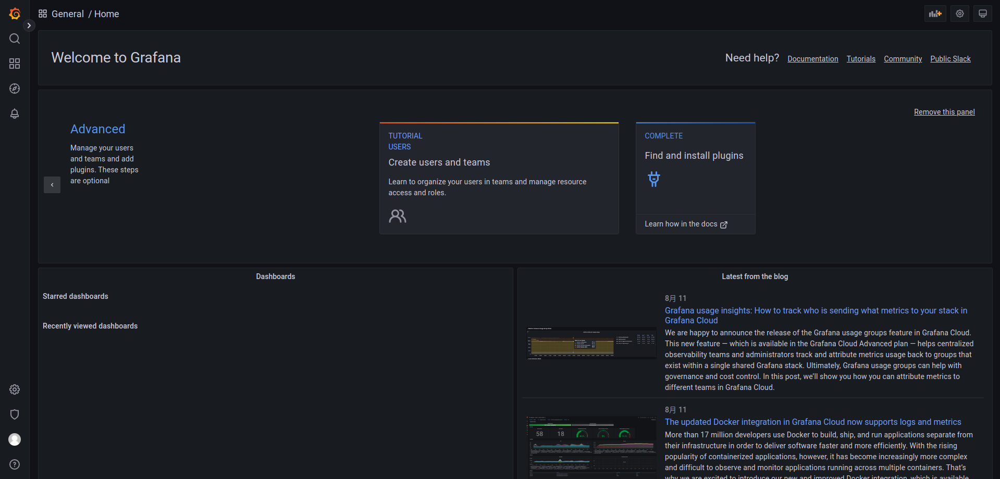
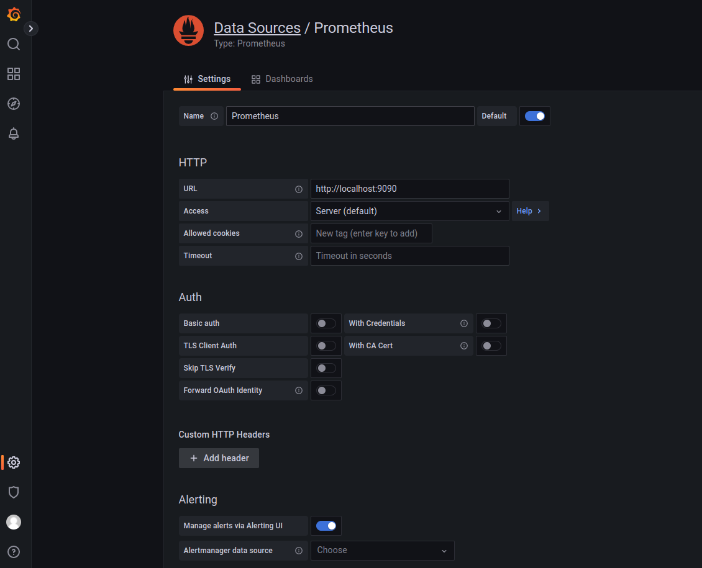
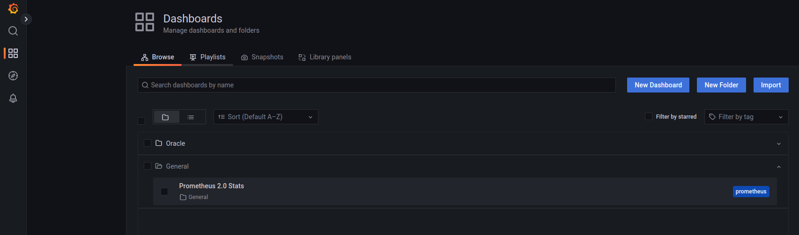
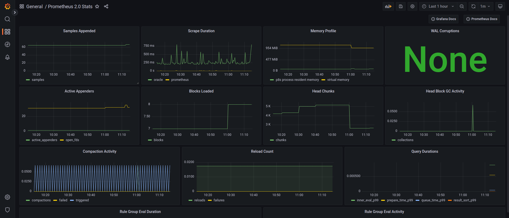

# Grafana 搭建与使用

用于监测和观察的开源平台（可结合 Prometheus 使用）。

Grafana 允许你**查询**、可视化、**预警**和了解你的指标，无论它们存储在哪里。创建、探索并与你的团队分享仪表盘，并培养一种数据驱动的文化。

Github：https://github.com/grafana/grafana

Official website：https://grafana.com/

Dashboard：https://grafana.com/grafana/dashboards/

## 1 Grafana 搭建

1. 下载软件压缩包并解压：https://grafana.com/grafana/download
2. cd 到解压后 grafana 根目录
3. 执行命令 `./bin/grafana-server -config ./conf/defaults.ini`
4. 访问 `http://127.0.0.1:3000`，用户名密码（默认）`admin:admin`
    

## 2 Grafana 使用

为了展示方便，首先需要启动 Prometheus 作为本次数据源（ [Prometheus 安装与使用](/zh-cn/Tools/ThirdTools/prometheus/README.md)）。

### 2.1 数据接入

启动 Grafana 后访问页面 `Configuration -> Data sources -> Add data source`，选择 Prometheus 并填写有关配置。



### 2.2 数据展示

Grafana 通过 Dashboards 展示数据，可自定义也可下载开放模板（https://grafana.com/grafana/dashboards/）。

这里选择开放模板，访问 `Dashboards -> Import` 填写开放模板 id 后，可以在 `Dashboards 页面查看。





### 2.3 插件下载

1. Grafana Plugin 可提供多种数据源接入（有些需要 Enterprise License）。

    ```shell
    ./bin/grafana-cli --pluginsDir /path/to/data/plugins plugins install grafana-oracle-datasource
    ```

    >--pluginsDir 指定插件目录

2. 然后修改 Grafana 启动时指定配置中 Plugins 的路径（默认路径）

    ```yaml
    # Directory where grafana will automatically scan and look for plugins
    plugins = data/plugins
    ```

3. 启动 Grafana

## 参考

[1] [Prometheus Grafana 之 Oracle 监控](https://www.modb.pro/db/28083)

[2] [Oracle 数据库监控、配置方法与监控指标](http://www.svngo.com/article75)

[3] [Prometheus+Grafana 搭建和使用](https://blog.csdn.net/qq_31725371/article/details/114697770)

[4] [Grafana Plugins](https://grafana.com/docs/grafana/next/cli/#plugins-commands)