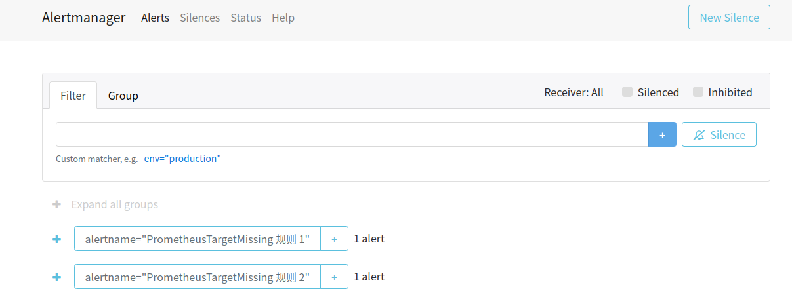

# Alertmanager

Github: https://github.com/prometheus/alertmanager

官方文档：https://prometheus.io/docs/alerting/latest/configuration

官方下载：https://prometheus.io/download/

常用告警规则：[Awesome Prometheus alerts](https://awesome-prometheus-alerts.grep.to/)（推荐）


## 1 告警原理
* 告警生成

在 Prometheus 中配置告警规则，例如“设备掉线”，“设备内存不足”，“请求数量异常”等。Prometheus 告警触发后可在 Prometheus Alerts 界面查看。

* 告警处理

Prometheus 配置后会将已触发告警发送到 Alertmanager 作进一步处理（**Prometheus 只产生告警，不处理告警**）。

* 告警转发

Alertmanager 中对告警**分组**、**抑制**、**静默**等操作后，将根据配置**转发**告警至 Webhook、短信、邮箱、钉钉等。


## 2 安装

安装 Prometheus： [点击查看](/zh-cn/Tools/ThirdTools/prometheus/README.md)

安装 OracleExporter： [点击查看](/zh-cn/Tools/ThirdTools/prometheus/oracle_exporter.md)

安装 Alertmanager：从 [官网下载](https://prometheus.io/download/) 后解压到合适路径


## 3 使用

为了使部署流程更顺利，这里先配置 Alertmanager 后再配置 Prometheus alert。

### 3.1 配置 Alertmanager

```yaml
# /path/to/alertmanager.yml
# 1. 设置告警时间（缩小间隔方便快速看到效果）
# 2. webhook（Alertmanager 收到告警后转发方式，会把告警发送到 url）
route:
  group_by: ['alertname']
  # group_wait 默认 30s
  group_wait: 5s
  # group_interval 默认 5m
  group_interval: 3s
  # repeat_interval 默认 4h
  repeat_interval: 8s
  receiver: 'web.hook'
receivers:
  - name: 'web.hook'
    webhook_configs:
      - url: 'http://127.0.0.1:5001'
```

### 3.2 配置 Prometheus 告警

* Prometheus Rule 告警规则（先不用理解具体语法含义）

```yaml
# /path/to/prometheus/alerts/example.yml
# 1. alerts 目录与 example.yml 文件都是新建的
# 2. 配置两条相同规则，检测 Prometheus Target 失联
groups:
  - name: node-alert
    rules:
    - alert: PrometheusTargetMissing 规则 1
      expr: up == 0
      for: 0m
      labels:
        severity: critical
      annotations:
        summary: Prometheus target 失联 (instance {{ $labels.instance }})
        description: "一个 Prometheus target 失联. exporter 可能已经崩溃.\n  VALUE = {{ $value }}\n  LABELS = {{ $labels }}"
    - alert: PrometheusTargetMissing 规则 2
      expr: up == 0
      for: 0m
      labels:
        severity: critical
      annotations:
        summary: Prometheus target 失联 (instance {{ $labels.instance }})
        description: "一个 Prometheus target 失联. exporter 可能已经崩溃.\n  VALUE = {{ $value }}\n  LABELS = {{ $labels }}"
```

* Prometheus（指定规则及 Alertmanager 地址）

```yaml
# /path/to/prometheus.yml

# Alertmanager 配置, 127.0.0.1:9093 是 Alertmanager 监听的地址
alerting:
  alertmanagers:
    - static_configs:
        - targets:
          - 127.0.0.1:9093

# alerts 是新建的目录, 存放 rule 告警规则
rule_files:
  - "alerts/*.yml"
```

### 3.3 启动测试

1. 启动 Prometheus、OracleExporter 查看 http://0.0.0.0:9090/ 可见已有 rule 且都正常

   

   

2. 启动 Alertmanager 查看网页 http://0.0.0.0:9093 先在没有告警

   ```sh
   # cd to alertmanager root
   ./alertmanager
   ```

   

3. 编写并启动 webhook 监听脚本，监听 5001

   ```python
   # test.py
   # python test.py
   from flask import Flask, request
   import json
   
   app = Flask(__name__)
   
   
   @app.route('/', methods=['POST'])
   def send():
       try:
           data = json.loads(request.data)
           alerts = data['alerts']
           for i in alerts:
               print('SEND SMS: ' + str(i))
       except Exception as e:
           print(e)
       return 'ok'
   
   
   if __name__ == '__main__':
       app.run(host='127.0.0.1', port=5001)
   ```

4. 中断 OracleExporter 等待片刻，Prometheus Alerts 界面、Alertmanager 界面可见异常

   

   

5. webhook 脚本也成功捕获数据

   


## 参考

[1] [Prometheus Alerting Configuration](https://prometheus.io/docs/alerting/latest/configuration/)

[2] [Prometheus 中文手册](https://hulining.gitbook.io/prometheus/alerting/configuration)

[3] [prometheus alertmanager 自定义 webhook](https://blog.csdn.net/qq_36961626/article/details/127010257)

[4] [Prometheus alertmanager 使用](https://www.cnblogs.com/infodriven/p/16316375.html)

