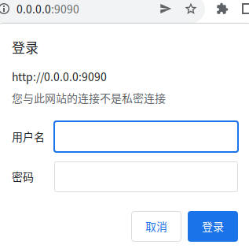
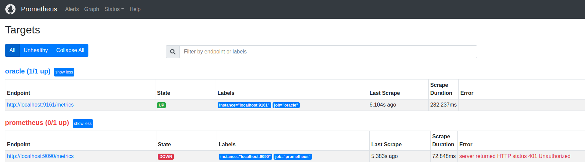

# Promethus 基础鉴权（basic_auth）配置

本文主要记录 prometheus 本身网页数据访问鉴权。

## 1 环境

promethus 版本：2.37.0

系统与架构：linux-amd64

## 2 配置

1. 安装 promethus（[Prometheus 快速安装与使用](/zh-cn/Tools/ThirdTools/prometheus/README.md)）

2. Prometheus 根目录生成 `config.yaml`（详情查看 [password 生成方式](https://prometheus.io/docs/guides/basic-auth/#hashing-a-password)）

   ```yaml
   password:
   $2b$12$hNf2lSsxfm0.i4a.1kVpSOVyBCfIB51VRjgBUyv6kdnyTlgWj81Ay
   ```

3. 启动 Prometheus（`--web.config.file` 指定配置）

   ```sh
   ./prometheus --config.file ./prometheus.yml --web.config.file ./config.yaml
   ```

4. `curl` 测试（用户名: `admin` 密码: `123456`）

   ```sh
   ➜  ~ curl http://localhost:9090/metrics         
   Unauthorized
   ➜  ~ curl http://localhost:9090/metrics -u admin
   Enter host password for user 'admin':
   ```

5. 登录网页已经需要登录

   


## 3 常见问题

### Prometheus 配置鉴权后采集数据异常



解决方式：配置 Promethues 根目录 `promethues.yml` 的 `basic_auth`

```yaml
scrape_configs:
  - job_name: "prometheus"
    static_configs:
      - targets: ["localhost:9090"]
    basic_auth:
      username: admin
      password: 123456
```


## 参考

[1] [Basic auth|Prometheus](https://prometheus.io/docs/guides/basic-auth/)

[2] [Prometheus TLS加密认证和基于 basic_auth 用户名密码访问](https://blog.csdn.net/qq_31725371/article/details/114978760)

