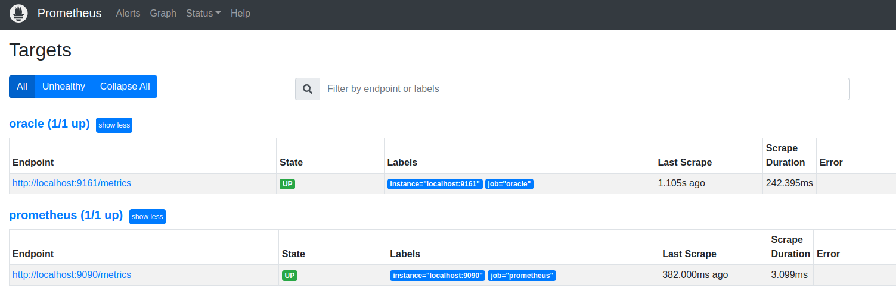

# Oracle Exporter

Prometheus Oracle 数据库指标采集器。

Github：https://github.com/iamseth/oracledb_exporter

Github Release：https://github.com/iamseth/oracledb_exporter/releases

## 安装与使用

1. 从 Github Release 页面下载压缩包并解压

2. 下载 Oracle Exporter 对应版本 [Oracle Instant CLient Basic](https://www.oracle.com/database/technologies/instant-client/downloads.html)（下载 Basic Package 版本即可，主要为了运行环境）

3. cd 到解压后根目录

4. 设置环境变量

   ```shell
   LD_LIBRARY_PATH=/path/to/instantclient-basic-linux.x64-18.5.0.0.0dbru/instantclient_18_5
   export LD_LIBRARY_PATH
   export DATA_SOURCE_NAME='[用户名]/[密码]@[地址]:[端口]/[SID/SERVICE_NAME]'
   # 例如：
   # export DATA_SOURCE_NAME='system/123456@localhost:1521/ORCLCDB.localdomain'
   ```

5. 执行 Oracle Exporter

   ```shell
   ./oracledb_exporter
   ```

6. 添加 Prometheus 配置文件规则

   ```yaml
   scrape_configs:
     - job_name: "oracle"
       scrape_interval: 10s
       static_configs:
         - targets: ["localhost:9161"]
   ```
   
7. 登录 `0.0.0.0:9090` 查看 Prometheus Status -> Targets 已经发现 oracle 端点

   

## 参考

[1] [Prometheus exporter](http://www.coderdocument.com/docs/prometheus/v2.14/instrumenting/exporters_and_integrations.html)

