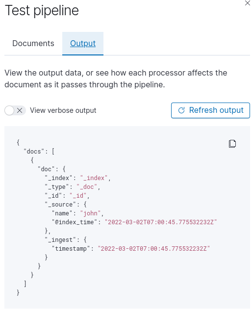

# 基于 ES Ingest piplines 实现自动添加时间

版本：7.16

Suggest 官方文档：https://www.elastic.co/guide/en/elasticsearch/reference/master/ingest.html


## 1. Ingest pipelines 介绍

Ingest pipelines 可以在索引前转换、处理数据，类似 logstash 自带的各种数据处理功能。

通常使用 Ingest pipelines 的流程如下：

1. 创建 Ingest Pipelines 规则，这里记作 r0；
2. 索引 template 中指定 r0 为其默认 pipeline 规则（可跳过，在发送索引数据时通过 pipeline 字段指定规则， 详细查看官方文档）；
3. 索引数据，查看 pipeline 规则 r0 是否生效。


## 2. 基础用法（基于 Kibana 测试）

Kibana（7.10）可通过 GUI 操作测试 Ingest piplines 的创建、修改、测试、删除。

步骤：

1. `Management` > `Stack Management` > `Ingest` > `Ingest Node Pipelines`

2. `Create a pipeline` > `Add a processor` > 填写字段 > `Add`；

   Processor 类型选择 `Set`，设置字段填写 `@index_time` = `{{_ingest.timestamp}}`

   

3.  `Create pipeline` 创建 pipeline（或 `Add documents` 测试 pipline）

   

   

   


## 3. 常见用法

上面通过 Kibana 可视化方法操作一般用来测试，实际使用中还是采用发送请求的方式实现。

1. 创建 ingest pipelines 规则 my_index_time

   ```json
   PUT _ingest/pipeline/my_index_time
   {
     "description": "为文档自动增加索引时间",
     "processors": [
       {
         "set": {
           "field": "@create_time",
           "value": "{{_ingest.timestamp}}",
           "description": "设置索引时间为 @index_time"
         }
       }
     ]
   }
   ```
   
2. 创建索引模板 my_index_template

   ```json
   PUT _template/my_index_template
   {
     "index_patterns": ["my_index"],  # 匹配 my_index 索引
     "order": 1,
     "settings": {
         "number_of_replicas": 0,
         "number_of_shards": 1,
         "default_pipeline": "my_index_time"  # 指定默认规则
     },
     "mappings": {
         "properties": {
             "name": {"type": "keyword"},
             "@index_time": {  # 指定接收字段可配置，否则会自动生成
                 "type": "date",
                 "format": "strict_date_optional_time||epoch_second"
             }
         }
     }
   }
   ```
   
3. 添加测试数据

   ```json
   PUT my_index/_doc/1
   {
     "name": "Lisa"
   }
   ```

   查询 mapping 可知，此时 my_index 的索引结构和预期一样

   ```json
   GET my_index/_mapping
   {
     "my_index" : {
       "mappings" : {
         "properties" : {
           "@index_time" : {
             "type" : "date",
             "format" : "strict_date_optional_time||epoch_second"
           },
           "name" : {
             "type" : "keyword"
           }
         }
       }
     }
   }
   ```

   查询文档，已经自动添加 `@index_time` 索引时间字段

   ```json
   GET my_index/_doc/_search
   {
     "took" : 0,
     "timed_out" : false,
     "_shards" : {
       "total" : 1,
       "successful" : 1,
       "skipped" : 0,
       "failed" : 0
     },
     "hits" : {
       "total" : {
         "value" : 1,
         "relation" : "eq"
       },
       "max_score" : 1.0,
       "hits" : [
         {
           "_index" : "my_index",
           "_type" : "_doc",
           "_id" : "1",
           "_score" : 1.0,
           "_source" : {
             "name" : "Lisa",
             "@index_time" : "2022-03-02T07:13:12.073050205Z"
           }
         }
       ]
     }
   }
   ```

