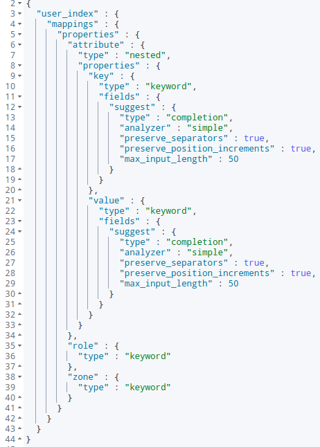
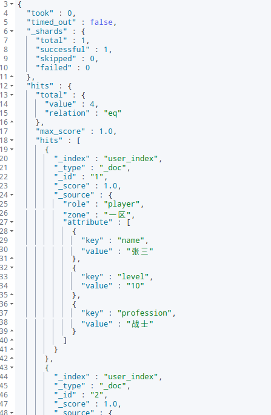
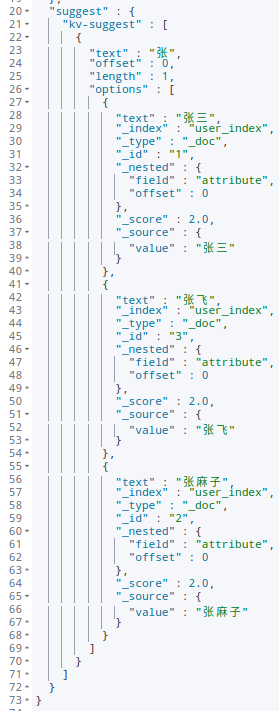
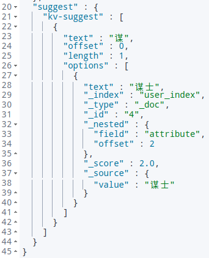

# 基于 Elasticsearch Suggest 实现输入提示功能

Elasticsearch 版本：7.16

Suggest 官方文档：https://www.elastic.co/guide/en/elasticsearch/reference/current/search-suggesters.html


## 1. Suggest 分类

es suggest 分为四种类型：

* Term Suggester（单词纠错提示，输入错误单词提示正确单词）
* Phrase Suggester（短语补全提示，输入一个单词提示整个短语）
* Completion Suggester（完全提示，输入单词前半部分，提示整个单词）
* Context Suggester（上下文提示）


## 2. Suggester 使用

参考：

[Elasticsearch Suggester API（自动补全）](https://www.cnblogs.com/wangzhuxing/p/9574630.html)

[Suggester 官方使用文档](https://www.elastic.co/guide/en/elasticsearch/reference/current/search-suggesters.html)


## 3. 基于 Suggester 实现单词提示

目的：对游戏全服所有角色信息进行存储，实现综合搜索提示。

### 3.1 数据结构

```json
[
    {
        "role": "player",
        "zone": "一区",
        "attribute": [
            {"key": "name", "value": "张三"},
            {"key": "level", "value": "10"},
            {"key": "profession", "value": "战士"},
            ...
        ]
    },
    {
        "role": "player",
        "zone": "一区",
        "attribute": [
            {"key": "name", "value": "张四"},
            {"key": "level", "value": "13"},
            {"key": "profession", "value": "法师"},
            ...
        ]
    }
]
```

### 3.2 Template 与 Data

首先对应数据结构，构建 es template 如下：

```json
{
    "mappings": {
        "properties": {
            "role": {"type": "keyword"},  // 账户类型
            "zone": {"type": "keyword"},  // 区服
            "attribute": {
                "type": "nested", // 采用 nested 结构存储，将角色信息视为一个整体
                "properties": { // 采用键值对的方式，可以灵活扩充信息
                    "key": {
                        "type": "keyword", // keyword 类型方便 es 查询
                        "fields": {"suggest": {"type": "completion"}}
                        // key.suggest 子字段用来提示, 避免与 keyword 查询冲突
                    },
                    "value": {
                        "type": "keyword", // keyword 类型方便 es 查询
                        "fields": {"suggest": {"type": "completion"}}
                        // value.suggest 子字段用来提示, 避免与 keyword 查询冲突
                    }
                }
            },
        }
    }
}
```

> 注意：上面设置子字段 suggest，如果不设置会导致普通 es 通过 nested 查询 key、value 查不到任何数据（[参考](https://blog.csdn.net/weixin_38106322/article/details/111568740)）

查看模板

```json
PUT _template/user_template
{
    "index_patterns": "user_index",
    "order": 0,
    "settings": {
        "number_of_replicas": 0,
        "number_of_shards": 1
    },
    "mappings": {
      "properties": {
        "role": {"type": "keyword"},
        "zone": {"type": "keyword"},
        "attribute": {
            "type": "nested",
            "properties": {
                "key": {
                    "type": "keyword",
                    "fields": {"suggest": {"type": "completion"}}
                },
                "value": {
                    "type": "keyword",
                    "fields": {"suggest": {"type": "completion"}}
                }
            }
        }
      }
    }
}
```

批量写入数据：

```json
POST user_index/_doc/_bulk
{"create":{"_id": "1"}}
{"role":"player","zone":"一区","attribute":[{"key":"name","value":"张三"},{"key":"level","value":"10"},{"key":"profession","value":"战士"}]}
{"create":{"_id": "2"}}
{"role":"player","zone":"一区","attribute":[{"key":"name","value":"张麻子"},{"key":"level","value":"7"},{"key":"profession","value":"土匪"}]}
{"create":{"_id": "3"}}
{"role":"player","zone":"一区","attribute":[{"key":"name","value":"张飞"},{"key":"level","value":"15"},{"key":"profession","value":"武将"}]}
{"create":{"_id": "4"}}
{"role":"player","zone":"一区","attribute":[{"key":"name","value":"汤师爷"},{"key":"level","value":"15"},{"key":"profession","value":"谋士"}]}
```

查看 user_index 索引结构及数据

```json
GET user_index/_mapping
```



查看数据

```json
GET user_index/_doc/_search
```



### 3.3 提示查询

基础查询语句如下，比如查询 **"张"** 开头的角色名字提示。

```json
GET user_index/_doc/_search
{
  "_source": ["attribute.value"],
  "suggest": {
    "kv-suggest": {
      "prefix": "张",
      "completion": {
        "field": "attribute.value.suggest",
        "size": 10,
        "skip_duplicates": "true",
        "fuzzy": {
            "fuzziness": "AUTO"
        }
      }
    }
  }
}
```



查询 **"谋"** 开头的职业提示。

```json
GET user_index/_doc/_search
{
  "_source": ["attribute.value"],
  "suggest": {
    "kv-suggest": {
      "prefix": "谋",
      "completion": {
        "field": "attribute.value.suggest",
        "size": 10,
        "skip_duplicates": "true",
        "fuzzy": {
            "fuzziness": "AUTO"
        }
      }
    }
  }
}
```

