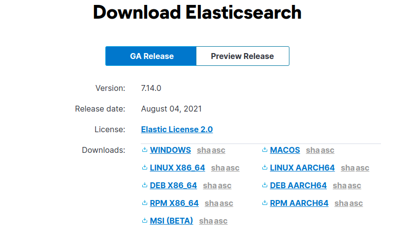
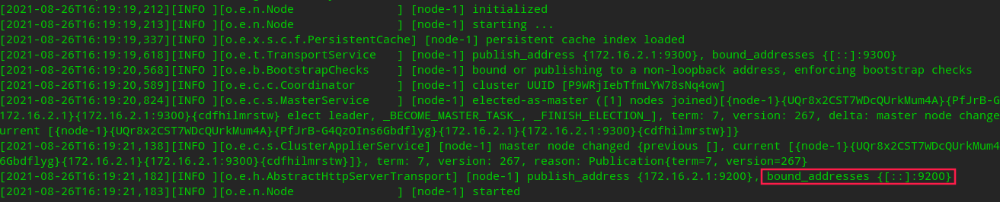

# Elasticsearch 环境搭建

## 1. 下载 Elasticsearch

推荐通过官方网址直接下载。

官方下载地址：https://www.elastic.co/cn/downloads/elasticsearch#ga-release




## 2. 配置文件（可选）

* [可选] 修改 jvm 内存大小（config/jvm.options）

  ```yaml
  -Xms4g
  -Xmx4g
  ```

* [推荐] 修改 elasticsearch 配置（config/elasticsearch.yml）

  ```yaml
  # 集群名
  cluster.name: my-application
  # 节点名，分布式 elasticsearch 部署不可重复
  node.name: node-1
  # 数据存放路径
  path.data: /path/to/tmp_data
  # 默认 Elasticsearch 只能被 localhost 访问，设置能访问的地址，0.0.0.0 代表所有地址都可访问（方便微服务访问）
  network.host: 0.0.0.0
  # 默认访问端口 9200
  http.port: 9200
  # 【可选】部署集群需要配置
  discovery.seed_hosts: ["127.0.0.1"]
  cluster.initial_master_nodes: ["node-1"]
  # 【可选】设置同源策略，记得改端口
  http.cors.allow-origin: 'http://localhost:1358'
  http.cors.enabled: true
  http.cors.allow-headers: X-Requested-With,X-Auth-Token,Content-Type,Content-Length,Authorization
  http.cors.allow-credentials: true
  ```


## 3. 启动 Elasticsearch

执行命令，看到 9200 执行成功。

```bash
./bin/elasticsearch
```


