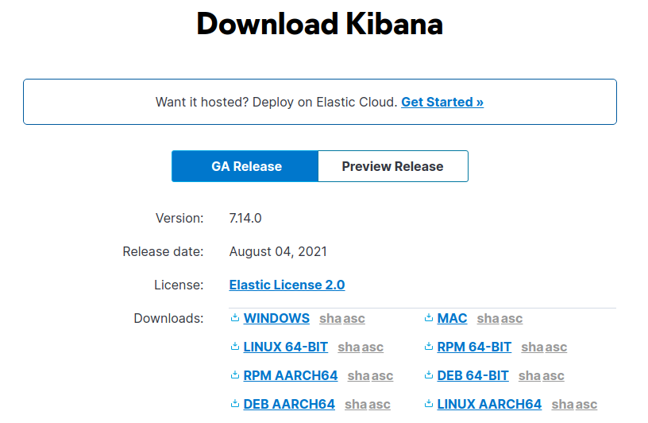
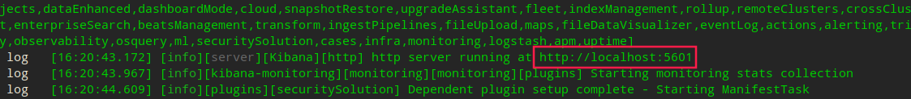

# Kibana 搭建与使用


## 1. 下载 Kibana

官方下载地址：https://www.elastic.co/cn/downloads/kibana




## 2. 启动 Kibana

> **必须**先运行 Elasticsearch，具体查看 [Elasticsearch 环境搭建](./Elasticsearch_build.md)。

执行命令，看到 5601 执行成功。

```shell
./bin/kibana
```

