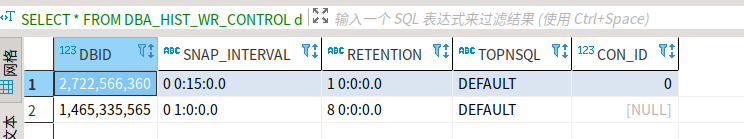

# Oracle AWR 报告生成与设置


## 1 AWR 报告生成

原理：使用 oracle 自带脚本 `awrrpt.sql` 生成报告。

1. 登录 oracle：`sqlplus / as sysdba`，回车
2. 执行脚本：`@?/rdbms/admin/awrrpt.sql`，回车
3. 输入报告生成类型（默认 `html`），回车
4. 输入报告包含 n 天的天数（默认所有），回车
5. 输入导出的开始日期 snap id（必须输入），回车
6. 输入导出的结束日期 snap id（必须输入），回车
7. 输入导出报告名称（默认 `awrrpt_1_x_x.html`），回车
8. 退出 oracle

最后报告默认保存路径：`sqlplus` 执行目录或 `/home/oracle/awrrpt_1_x_x.html`


## 2 AWR 报告生成原理

 `awrrpt.sql` 会调用 `awrrpti.sql` 脚本。

 `awrrpti.sql` 会调用 dbms 函数 `DBMS_WORKLOAD_REPOSITORY.AWR_REPORT_HTML` 生成报告。

>有关脚本介绍：
>
>awrrpt.sql -- 生成指定快照区间的统计报告  
>awrrpti.sql -- 生成指定数据库实例，并指定快照区间的统计报告  
>awrsqlrpt.sql -- 生成指定快照区间，指定SQL语句的统计报告  
>awrsqrpi.sql -- 生成指定数据库实例、指定快照区间的指定SQL语句的统计报告  
>awrddrpt.sql -- 指定两个不同的时间周期，生成这两个周期的统计对比报告  
>awrddrpi.sql -- 指定数据库实例，并指定两个的不同时间周期，生成这两个周期的统计对比报告

同理可**手动执行** SQL 方式获取报告

1. 查询数据库 ID

   ```sql
   SELECT d.DBID FROM v$database d;
   ```

2. 获取实例 ID

   ```sql
   SELECT i.INSTANCE_NUMBER FROM v$instance i;
   ```

3. 查询快照 ID

   ```sql
   -- 获取快照
   SELECT * FROM DBA_HIST_SNAPSHOT T ORDER BY SNAP_ID;
   
   -- 获取最后 10 次快照 id
   SELECT SNAP_ID FROM DBA_HIST_SNAPSHOT T ORDER BY SNAP_ID DESC offset 0 ROW FETCH NEXT 10 ROW ONLY
   
   -- 精简快照展示
   select a.instance_number,a.dbid,a.snap_id,a.begin_interval_time,a.end_interval_time from dba_hist_snapshot a order by a.snap_id desc;
   ```

4. 生成报告

   ```sql
   SELECT * FROM TABLE(DBMS_WORKLOAD_REPOSITORY.AWR_REPORT_HTML(数据库ID, 实例ID, 开始快照ID, 结束快照ID, 0));
   ```
   
   > AWR_REPORT_HTML 同类函数还有 AWR_REPORT_TEXT（详见 [Oracle 用 dbms_workload_repository 取 AWR 报告方法](https://blog.csdn.net/demonson/article/details/81387549)）


## 3 AWR 数据采集周期

查询 AWR 数据采集周期（默认 1 小时采集一次，保存 8 天）

```sql
SELECT * FROM DBA_HIST_WR_CONTROL dhwc;
```

登录 `sqlplus / as sysdba` 修改采集周期为 15 分钟采集一次，保存 1 天

```sql
EXECUTE dbms_workload_repository.modify_snapshot_settings(interval => 15,retention => 1*24*60);
```

不出意外会报错，报错原因是设置快照 retetion（60x60x24x2 = 172800）比“系统滑动窗口基线大小”小（691200 = 60x60x24x8）


所以修改“系统滑动窗口基线”为 1 天

```sql
EXECUTE dbms_workload_repository.modify_baseline_window_size(1);
```

再次修改采集周期

```sql
EXECUTE dbms_workload_repository.modify_snapshot_settings(interval => 15,retention => 1*24*60);
```


检查 AWR 数据采集周期 `SELECT * FROM DBA_HIST_WR_CONTROL dhwc`



检查“系统滑动窗口基线大小” `SELECT DBID, BASELINE_ID, MOVING_WINDOW_SIZE from dba_hist_baseline;`


## 参考

[1] [Oracle 数据库生成 AWR 报告方法](https://blog.csdn.net/qq_17018417/article/details/120970431)

[2] [Oracle AWR 生成常用脚本](https://developer.aliyun.com/article/752612)

[3] [Oracle 用 dbms_workload_repository 取 AWR 报告方法](https://blog.csdn.net/demonson/article/details/81387549)

[4] [Oracle11g 修改 AWR 数据采样时间间隔及历史快照保留时间](https://blog.csdn.net/weixin_35866180/article/details/112712094)

