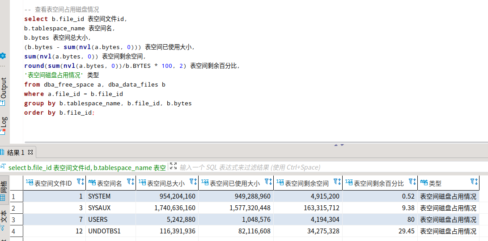
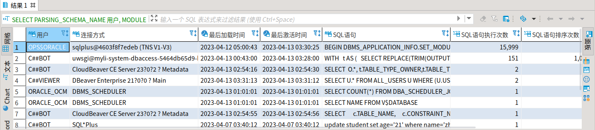
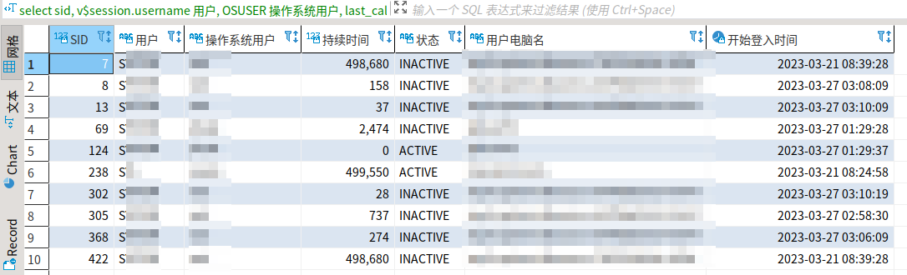
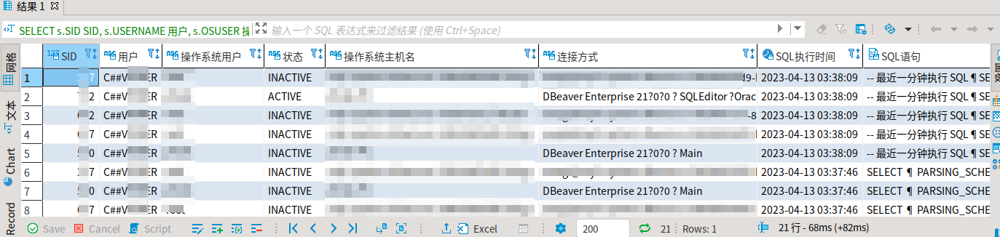
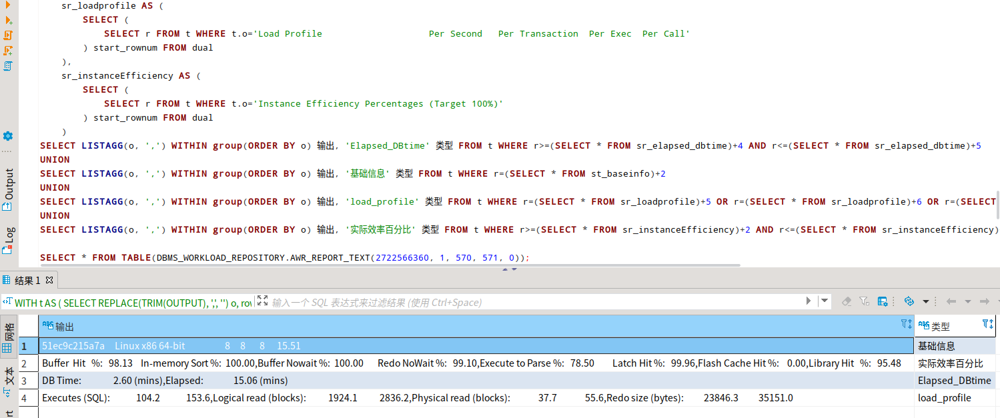

# Oracle SQL 查询 AWR 数据

在开始之前，先熟悉 Oracle AWR 生成与使用（快速开始 [报告生成与设置](/zh-cn/Database/Oracle/oracle_awr.md)）

## 非 AWR 相关指标

* 查看表空间概况

  ```sql
  -- 查看表空间占用磁盘情况
  select b.file_id 表空间文件id,
  b.tablespace_name 表空间名,
  b.bytes 表空间总大小,
  (b.bytes - sum(nvl(a.bytes, 0))) 表空间已使用大小,
  sum(nvl(a.bytes, 0)) 表空间剩余空间,
  round(sum(nvl(a.bytes, 0))/b.BYTES * 100, 2) 表空间剩余百分比,
  '表空间磁盘占用情况' 类型
  from dba_free_space a, dba_data_files b
  where a.file_id = b.file_id
  group by b.tablespace_name, b.file_id, b.bytes
  order by b.file_id;
  ```

  

* 最耗性能的10条SQL语句（优化，执行时间 desc）

  ```sql
  -- 最耗性能 sql
  SELECT 
  	PARSING_SCHEMA_NAME 用户,
  	MODULE 连接方式,
  	LAST_LOAD_TIME 最后加载时间,
  	LAST_ACTIVE_TIME 最后激活时间,
  	sql_text sql语句,
  	EXECUTIONS sql语句执行次数,
  	SORTS sql语句排序次数,
  	DISK_READS sql语句磁盘读次数,
  	'最耗性能sql' 类型
  FROM v$sqlarea
  WHERE PARSING_SCHEMA_NAME NOT IN ('SYS', 'SYSTEM')
  AND MODULE IS NOT NULL
  AND rownum < 11
  ORDER BY executions DESC
  ```
  
  
  
* 查询数据库 Session

  ```sql
  select sid SID,
  v$session.username 用户,
  OSUSER 操作系统用户,
  last_call_et 持续时间,
  status 状态,
  machine 用户主机名,
  logon_time 登入时间,
  'session情况' 类型
  from v$session
  where v$session.username is not NULL
  ```
  
  
  
* 连接用户最近1分钟执行 SQL

  ```sql
  SELECT s.SID SID,
  s.USERNAME 用户,
  s.OSUSER 操作系统用户,
  s.STATUS 状态,
  s.MACHINE 操作系统主机名,
  s.PROGRAM 连接方式,
  area.last_active_time SQL执行时间,
  area.sql_fulltext SQL语句,
  '最近sql执行情况' 类型
  FROM v$session s, v$sqlarea area
  WHERE s."USER#" = area.PARSING_USER_ID
  AND s.username NOT IN ('SYS', 'SYSTEM')
  AND area.last_active_time > sysdate - 1/24/60
  order by area.last_active_time DESC
  ```
  
  

## AWR 相关指标

AWR 相关指标通过调用 DBMS_WORKLOAD_REPOSITORY.AWR_REPORT_TEXT 实现，每次查询很慢无法做到大量查询，所以最好的方式是：

1. 通过 AWR 命令生成 html 报告；
2. 查看 html 报告中需要的指标；
3. 构造查询 SQL 一起查询并通过 UNION 聚合。

例如，这里查询 Elapsed/DBTime、基础信息、load_profile、实际效率百分比这四个指标：

```sql
WITH 
	t AS (
		SELECT REPLACE(TRIM(OUTPUT), ',', '') o, rownum r FROM TABLE( -- replace 转换数字中逗号；trim 过滤前后空格
			DBMS_WORKLOAD_REPOSITORY.AWR_REPORT_TEXT(
				(SELECT d.DBID FROM v$database d), -- 获取快照
				(SELECT i.INSTANCE_NUMBER FROM v$instance i), -- 查询 instance number
				(SELECT SNAP_ID FROM DBA_HIST_SNAPSHOT ORDER BY SNAP_ID DESC offset 1 ROW FETCH NEXT 1 ROW ONLY), -- 倒数第二次快照 id 作为起始 id
				(SELECT SNAP_ID FROM DBA_HIST_SNAPSHOT ORDER BY SNAP_ID DESC offset 0 ROW FETCH NEXT 1 ROW ONLY), -- 最后一次快照 id 作为终止 id
				8 -- 控制标志仅为 0 或 8, 8 代表输出 ADDM 建议
			)
		)
	),
	st_baseinfo AS (
		SELECT (
			SELECT r FROM t WHERE t.o='Host Name        Platform                         CPUs Cores Sockets Memory(GB)'
		) start_rownum FROM dual
	),
	sr_elapsed_dbtime AS (
		SELECT (
			SELECT r FROM t WHERE t.o='Snap Id      Snap Time      Sessions Curs/Sess  PDBs'
		) start_rownum FROM dual
	),
	sr_loadprofile AS (
		SELECT (
			SELECT r FROM t WHERE t.o='Load Profile                    Per Second   Per Transaction  Per Exec  Per Call'
		) start_rownum FROM dual
	),
	sr_instanceEfficiency AS (
		SELECT (
			SELECT r FROM t WHERE t.o='Instance Efficiency Percentages (Target 100%)'
		) start_rownum FROM dual
	)
SELECT LISTAGG(o, ',') WITHIN group(ORDER BY o) 输出, 'Elapsed_DBtime' 类型 FROM t WHERE r>=(SELECT * FROM sr_elapsed_dbtime)+4 AND r<=(SELECT * FROM sr_elapsed_dbtime)+5
UNION
SELECT LISTAGG(o, ',') WITHIN group(ORDER BY o) 输出, '基础信息' 类型 FROM t WHERE r=(SELECT * FROM st_baseinfo)+2
UNION
SELECT LISTAGG(o, ',') WITHIN group(ORDER BY o) 输出, 'load_profile' 类型 FROM t WHERE r=(SELECT * FROM sr_loadprofile)+5 OR r=(SELECT * FROM sr_loadprofile)+6 OR r=(SELECT * FROM sr_loadprofile)+8 OR r=(SELECT * FROM sr_loadprofile)+21
UNION
SELECT LISTAGG(o, ',') WITHIN group(ORDER BY o) 输出, '实际效率百分比' 类型 FROM t WHERE r>=(SELECT * FROM sr_instanceEfficiency)+2 AND r<=(SELECT * FROM sr_instanceEfficiency)+7
```



