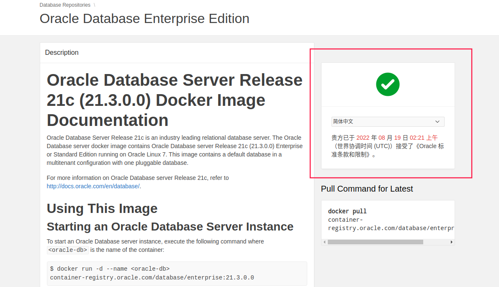

# Oracle 搭建与部署

Oracle 官方已经提供较为详细的文档。

## 1 By Docker

### 1.1 获取 Oracle Docker Image

首先需要获取 Oracle 官方 Docker Image 的基础镜像。

1. 登录官方 images registry（网上找一个 Oracle 公开分享的账户，好人一生平安）

   ```shell
   docker login container-registry.oracle.com
   ```

2. 登录 [Oracle Docker Image](https://container-registry.oracle.com) 官方仓库寻找镜像（Database -> enterprise），点击右边登录然后授权（同一个账户）。

   
   
3. 拉取最新镜像

   ```shell
   docker pull container-registry.oracle.com/database/enterprise:latest
   ```

### 1.2 准备映射目录

在主机创建 `oradata` 目录作为映射到容器 Oracle 数据的目录。

oracle docker 数据目录为 `/opt/oracle/oradata`，映射直接启动镜像会遇到 ["Cannot create directory"](https://github.com/oracle/docker-images/blob/main/OracleDatabase/SingleInstance/FAQ.md#cannot-create-directory-error-when-using-volumes) 问题。

正确的做法是，创建 `oradata` 目录并更改其权限。

```shell
sudo chown 54321:54321 oradata
```

### 1.3 最终 docker-compose.yml

```yaml
# docker-compose.yml
version: "3.3"

networks:
  oracle:
    external: false

services:
  oracle:
    image: container-registry.oracle.com/database/enterprise:21.3.0.0
    container_name: oracle
    environment:
      - ORACLE_SID=ORCLCDB
      - ORACLE_PDB=ORCLPDB1
      - ORACLE_PWD=I6wHgPwQhEqqWwT  # oracle database 密码
    volumes:
      - ./oradata:/opt/oracle/oradata
    ports:
      - 1521:1521
    networks:
      - oracle
```

## 2 测试

连接进入 docker 后，执行以下命令测试（任选其一）。

```shell
sqlplus / as sysdba
sqlplus sys/<your_password>@<your_SID> as sysdba
sqlplus system/<your_password>@<your_SID>
sqlplus pdbadmin/<your_password>@<your_PDBname>
```

## 3 参考

* [Oracle Docker Image](https://container-registry.oracle.com) ( 寻找镜像仓库 Database -> enterprise 使用文档)
* [Oracle Database Enterprise Edition Installation Guide for Docker Containers For Oracle Linux x86-64](https://docs.oracle.com/en/database/oracle/oracle-database/21/deeck/index.html)