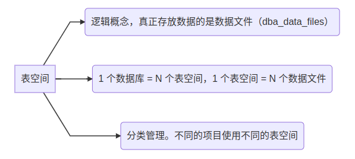

# Oracle 表空间

## 概述

## 表空间类型

Oracle 12c数据库系统默认创建的空间及其对应的默认用户如下表：

| 表空间名称 | 默认用户                                                     | 功能                                                         |
| ---------- | ------------------------------------------------------------ | ------------------------------------------------------------ |
| SYSTEM     | SYS、SYSTEM、OUTLN、LBACSYS                                  | 创建数据库时自动创建的表空间，**存储系统重要的数据库对象**，例如数据库的数据字典、系统的管理信息、系统存储过程和系统回退段等 |
| SYSAUX     | APEX_040200、DVF、MDSYS、OLAPSYS、CTXSYS、DVSYS、ORDDATA、FLOWS_FILES、GSMADMIN_INTERNAL、ORDPLUGINS、DBSNMP、ORDSYS、APPQOSSYS、XDB、SI_INFORMTN_SCHEMA、WMSYS、ANONYMOUS | 是 SYSTEM 表空间的一个**辅助表空间**，一些与 Oracle 特性相关的对象，例如 LogMiner、CTX、Streams 等创建对象都保存在该表空间中。SYSAUX 表空间用于减少 SYSTEM 表空间的负荷，提高系统的作业效率。这个表空间是在创建数据库时自动创建的，主要用于存放**数据库组件**，一般不用于存储用户数据，由 Oracle 系统**内部自动维护**。如果SYSAUX表空间不可用时，数据库的核心功能还是可以继续运行的，只是一些存放在SYSAUX表空间里的功能受到限制 |
| USERS      | SYSKM、XS$NULL、DIP、SPATIAL_WFS_ADMIN_USR、GSMUSER、GSMCATUSER、SPATIAL_CSW_ADMIN_USR、SYSBACKUP、AUDSYS、ORACLE_OCM、OJVMSYS、APEX_PUBLIC_USER、MDDATA、SYSDG | 是用户的默认**永久性表空间**，用于存储永久用户对象和私有信息 |
| UNDOTBS1   | 无                                                           | UNDOTBS1 为数据库的**撤消表空间**，用于在自动撤消管理方式下存储撤消信息。在此空间存储对数据库进行修改操作之前的数据，用于数据恢复。在撤消表空间中，除了回退段以外，不能建立任何其他类型的段。所以，用户不可以在撤消表空间中创建数据库对象 |
| TEMP       | 无                                                           | TEMP为**临时表空间**，用于存放临时数据，例如存储排序时产生的临时数据。一般情况下，数据库中的所有用户都使用 temp 作为默认的临时表空间。临时表空间本身不是临时存在的，而是永久存在的，只是保存在临时表空间中的段是临时的。临时表空间的存在，可以减少临时段与存储在其他表空间中的永久段之间的磁盘 I/O 争用 |

## 参考

[1] [Oracle 表空间详解（tablespace）](https://blog.csdn.net/qq_34745941/article/details/91039626)

[2] [oracle--表空间类型](https://blog.csdn.net/weixin_50393358/article/details/125388523)

[3] [Oracle 表空间（tablespace）介绍](https://blog.csdn.net/cnds123/article/details/125151902)

