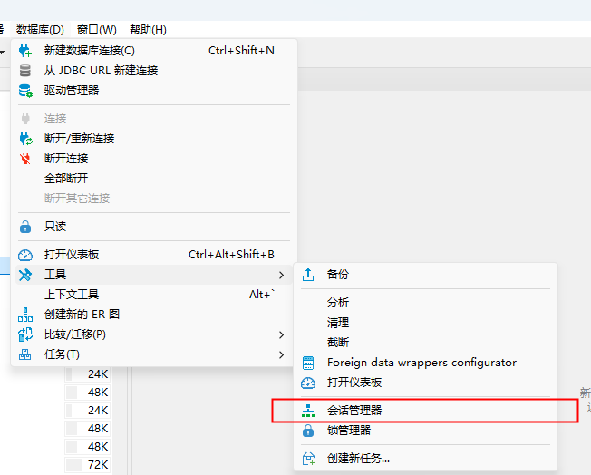

# PostgreSQL 连接过多

使用 pg 过程中提示报错：

`sorry, too many clients already`

也就是当前 pg 的连接过多，需要排查是否原因。

## 使用命令行排查

连接数据库查看连接数：

```shell
	psql -U {数据库用户名} -d {数据库名}
	show max_connections;
```

查看当前连接数

```shell
SELECT count(*) FROM pg_stat_activity;
```

查看指定连接

```shell
SELECT * FROM pg_stat_activity;

SELECT count(*) FROM pg_stat_activity where application_name='xxxx';

SELECT pid, usename, state, query FROM pg_stat_activity WHERE state IN ('idle', 'idle in transaction');
```

## 使用工具排查

使用 dbeaver 连接数据库，打开数据库-工具-会话管理器


