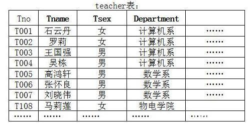
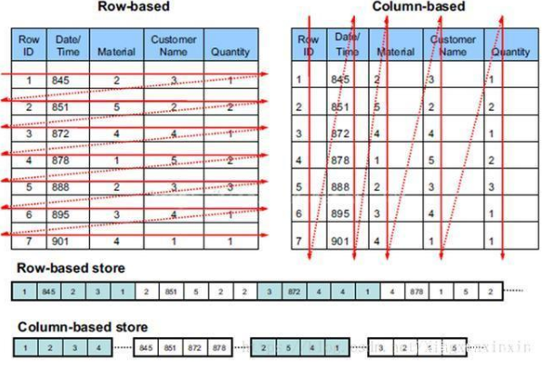

# 数据库种类

* **关系型数据库**

  最古老的数据库类型，关系型数据库模型是把复杂的数据结构归结为简单的二元关系（即二维表格形式）。

  

  在关系型数据库中，对数据的操作几乎全部建立在一个或多个关系表格上。在大型系统中通常有多个表，且表之间有各种关系。实际使用就是通过对这些关联的表格分类、合并、连接或选取等运算来实现数据库的管理。

  代表数据库软件：MySQL、SQLite

* **键值存储数据库**

  键值数据库是一种非关系数据库，它使用简单的键值方法来存储数据。键值数据库将数据存储为键值对集合，其中键作为唯一标识符。

  代表数据库软件：Redis

* **列存储数据库**

  列式存储(column-based)是相对于传统关系型数据库的行式存储(Row-basedstorage)来说的。简单来说两者的区别就是对表中数据的存储形式的差异。

  

  上图统行数据库和列数据库表中数据在磁盘上的存储形式的差异对比。

  对于行存储数据库，表中的数据是以行为单位逐行存储在磁盘上的；而对于列存储数据库，表中的数据则是以列为单位逐列存储在磁盘中。

  列存储解决的主要问题是数据查询问题。我们知道，平时的查询大部分都是条件查询，通常是返回某些字段（列）的数据。对于行存储数据，数据读取时通常将一行数据完全读出，如果只需要其中几列数据的情况，就会存在冗余列，出于缩短处理时间的考量，消除冗余列的过程通常是在内存中进行的。**而列存储，每次读取的数据是集合的一段或者全部，不存在冗余性问题**。这样，通过这种存储方式的调整，使得查询性能得到极大的提升。

  代表数据库软件：HBase

* **面向文档数据库**

  此类数据库可存放并获取文档，可以是XML、JSON、BSON等格式，这些文档具备可述性（self-describing），呈现分层的树状结构（hierarchical tree data structure），可以包含映射表、集合和纯量值。数据库中的文档彼此相似，但不必完全相同。文档数据库所存放的文档，就相当于键值数据库所存放的“值”。文档数据库可视为其值可查的键值数据库。

  代表数据库软件：MongoDB、CouchDB、Terrastore、RavenDB、OrentDB 等

* **图形数据库**

  图形数据库顾名思义，就是一种存储图形关系的数据库。图形数据库是NoSQL数据库的一种类型，它应用图形理论存储实体之间的关系信息。关系型数据用于存储明确关系的数据，但对于复杂关系的数据存储却有些力不从心。如下图这种人物之间的关系，如果用关系型数据库则非常复杂，用图形数据库将非常简单。

  

  代表数据库软件：Neo4J、ArangoDB、OrientDB、FlockDB、GraphDB、InfiniteGraph、Titan、Cayley 等

* **搜索引擎存储**

  搜索引擎数据库是应用在搜索引擎领域的数据存储形式，由于搜索引擎会爬取大量的数据，并以特定的格式进行存储，这样在检索的时候才能保证性能最优。

  代表数据库软件：Solr、Elasticsearch

----

参考

[1] [最全的数据库分类及实例介绍](https://baijiahao.baidu.com/s?id=1626625811239051052&wfr=spider&for=pc)

