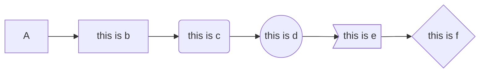
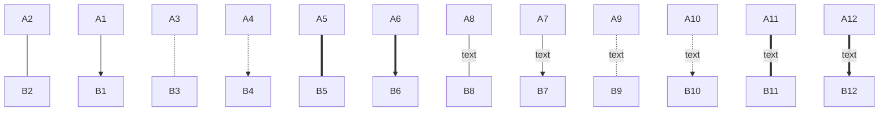
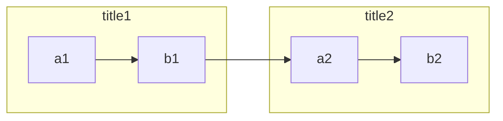
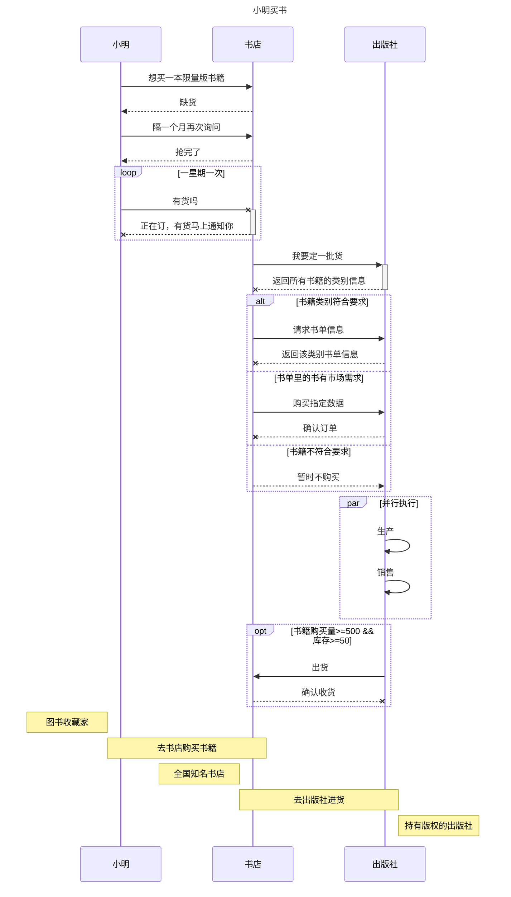
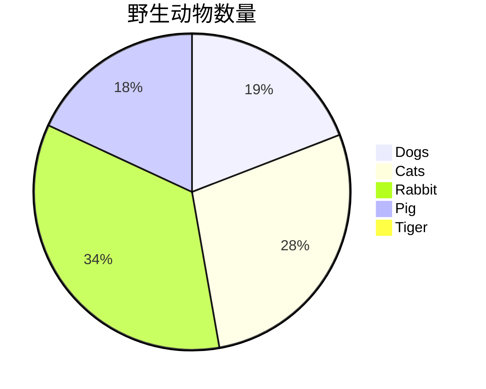
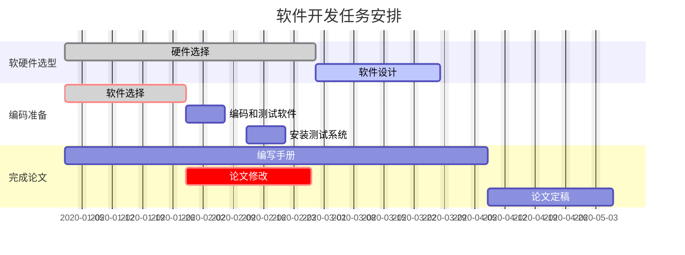

# Markdown 画图

<!-- toc -->

## 1. 准备环境

&emsp;&emsp;使用 `Typora` 软件。

&emsp;&emsp;**关键词**：mermaid

## 2. 画图基础

### 2.1 图方向

| 关键字 |   方向   |
| :----: | :------: |
|   TB   | 从上到下 |
|   BT   | 从下到上 |
|   LR   | 从左到右 |
|   RL   | 从右到左 |

> T=TOP B=BOTTOM L=LEFT R=RIGHT

### 2.2 节点形状

|  关键字   |   节点名   |
| :-------: | :--------: |
|     A     |  默认节点  |
|  B[name]  |  文本节点  |
|  C(name)  |  圆角节点  |
| D((name)) |  圆形节点  |
|  E>name]  | 非对称节点 |
|  F{name}  |  菱形节点  |

> A~F 是节点名，类似变量。
>
> name 是节点显示文字。

```
graph LR;
	A-->B
	B[this is b]-->C
	C(this is c)-->D
	D((this is d))-->E
	E>this is e]-->F
	F{this is f}
```



### 2.3 连线形状

| 关键字（基础） | 关键字（带文本） |      样式      |
| :------------: | :--------------: | :------------: |
|      ---       |    --text---     |      实线      |
|      -->       |    --text-->     | 实线（带箭头） |
|      -.-       |     -.text.-     |      虚线      |
|      -.->      |    -.text.->     | 虚线（带箭头） |
|      ===       |    ==text===     |      粗线      |
|      ==>       |    ==text==>     | 粗线（带箭头） |

```
graph TB
	A2---B2
	A1-->B1
	A3-.-B3
	A4-.->B4
	A5===B5
	A6==>B6
	A8--text---B8
	A7--text-->B7
	A9-.text.-B9
	A10-.text.->B10
	A11==text===B11
	A12==text==>B12
```



### 2.4 子图

|    关键字     | 作用 |               注意               |
| :-----------: | :--: | :------------------------------: |
| subgraph, end | 子图 | 子图节点名不是隔离，而是全局变量 |

```
graph LR
	subgraph title1
		a1-->b1
	end
	subgraph title2
		a2-->b2
	end
	b1-->a2
```



## 3. 画图进阶

### 3.1 序列图（[参考示例](https://www.jianshu.com/p/77cc07f47cdc)）

序列图共有 5 个部分，分别是：**参与者**、**消息线**、**循环**、**选择**、**可选**、**并行**、**注解**。

|     关键字      |              作用              | 语法                                                         |
| :-------------: | :----------------------------: | ------------------------------------------------------------ |
| sequenceDiagram |           定义图类型           |                                                              |
|      title      |              图名              |                                                              |
|   participant   | 参与者，通过参与者展示控制顺序 | participant 变量名<br>participant 变量名 as 参与者名称       |
|                 |             消息线             | -> 无箭头 实线<br>--> 无箭头 虚线<br/>->> 有箭头 实线（主动发同步消息）<br/>-->> 有箭头 虚线（同步响应）<br/>-x 末端X 实线（主动发异步消息）<br/>--x 有箭头 实线（异步响应） |
|    loop end     |              循环              | loop 循环名称<br>    statements<br>end                       |
|  alt else end   |        选择，多条件判断        | alt 选择条件<br>    statements<br>else<br>    statements<br>end |
|     opt end     |        可选，单条件判断        | opt 可选条件<br>    statements<br>end                        |
|     par end     |              并行              | par 并行执行<br/>    statements<br/>end                      |
|      note       |              注解              | note right of 变量1, 变量2...: 注释内容<br>note left of 变量1, 变量2...: 注释内容<br>note over 变量1, 变量2...: 注释内容 |

将下面代码放进 `Typora` 代码块选择 `mermaid` 可查看效果。

```
sequenceDiagram
title: 小明买书

participant consumer as 小明
participant store as 书店
participant publisher as 出版社

consumer->>store: 想买一本限量版书籍
store-->>consumer: 缺货
consumer->>store: 隔一个月再次询问
store-->>consumer: 抢完了
loop 一星期一次
consumer -x +store: 有货吗
store --x -consumer: 正在订，有货马上通知你
end

store->>+publisher: 我要定一批货
publisher --x -store: 返回所有书籍的类别信息

alt 书籍类别符合要求
store->>publisher: 请求书单信息
publisher --x store: 返回该类别书单信息
else 书单里的书有市场需求
store->>publisher: 购买指定数据
publisher --x store: 确认订单
else 书籍不符合要求
store -->> publisher: 暂时不购买
end

par 并行执行
publisher->>publisher: 生产
publisher->>publisher: 销售
end

opt 书籍购买量>=500 && 库存>=50
publisher->>store: 出货
store --x publisher: 确认收货
end

note left of consumer: 图书收藏家
note over consumer, store: 去书店购买书籍
note left of store: 全国知名书店
note over store, publisher: 去出版社进货
note right of publisher: 持有版权的出版社
```



### 3.2 饼图

| 关键字 |    作用    | 语法               |
| :----: | :--------: | ------------------ |
|  pie   | 定义图类型 |                    |
| title  |  定义图名  | tittle: 图表题     |
|   ""   |  定义类别  | "类别名": 类别数量 |

```
pie
title 野生动物数量
"Dogs": 386
"Cats": 567
"Rabbit": 700
"Pig": 365
"Tiger": 15
```



### 3.3 甘特图

规则

```
gantt
 dateFormat  YYYY-MM-DD    //底部的时间格式
 title     Adding GANTT diagram functionality to mermaid   //甘特图名称
 excludes   weekends               //周末有休息

 section A         //可以理解为一个功能模块
 task1        :done,des1, 2014-01-06,2014-01-08   //可以理解为这个功能模块的各项进度安排
 task2        :active,des2, 2014-01-09, 3d      //以下参数都是合法的
 task3        :des3, after des2, 5d          //我们等一下每个都试一下
 task4        :crit, done, 2014-01-06,24h
 task5        :crit, done, after des1, 2d
 task6        :crit, active, 3d
 task7        :crit, 5d
 task8        :2d
 task9        :1d
 ...         :[参数1:crit,可不填],[参数2:active,done,可不填表示待完成],[参数3:小名],[参数4:开始时间],[参数5:结束时间]
 section B
 section C 
 ...
```

示例

```
gantt
dateFormat YYYY-MM-DD
title 软件开发任务安排 
excludes weekends

section 软硬件选型 
硬件选择: done,desc1,2020-01-01,6w
软件设计: active,desc2,after desc1,3w

section 编码准备
软件选择: crit,done,desc3,2020-01-01,2020-01-29
编码和测试软件: 1w
安装测试系统: 2020-02-12,1w

section 完成论文
编写手册: desc5,2020-01-01,10w
论文修改: crit,after desc3,3w
论文定稿: after desc5,3w
```



### 3.4 流程图（略）

[可搜索其他博客](https://www.jianshu.com/p/7065927f7c1b)

