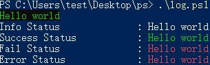
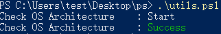

# PowerShell 函数封装

## 0. 函数引用

```powershell
# 目录结构
# ---a.ps1
#  |-b.ps1
 
# a.ps1 内容
. .\b.ps1 # 引用 b.ps1
Print "hello world"

# b.ps1 内容
function Print {
    Write-Host $args -ForegroundColor Green -BackgroundColor Black
}
```

## 1. 系统操作

**日志信息输出**（可换成其他颜色）

```powershell
# log.ps1

$PADDINGLENGTH = 25

function Info {
    $label = ($args)[0].ToString()
    $message = ($args)[1]
    Write-Host ("{0}: " -f $label.PadRight($PADDINGLENGTH)) -NoNewline
    Write-Host $message -ForegroundColor White
}

function Success {
    $label = ($args)[0].ToString()
    $message = ($args)[1]
    Write-Host ("{0}: " -f $label.PadRight($PADDINGLENGTH)) -NoNewline
    Write-Host $message -ForegroundColor Green
}

function Fail {
    $label = ($args)[0].ToString()
    $message = ($args)[1]
    Write-Host ("{0}: " -f $label.PadRight($PADDINGLENGTH)) -NoNewline
    Write-Host $message -ForegroundColor Red
}

function ExitProcess {
    $exit_code = ($args)[0]
    Fail $args[1] $args[2]
    Exit $exit_code
}

function Print {
    Write-Host $args -ForegroundColor Green -BackgroundColor Black
}

Print "Hello world"
Info "Info Status" "Hello world"
Success "Success Status" "Hello world"
Fail "Fail Status" "Hello world"
ExitProcess -1 "Error Status" "Hello world"
```



**系统架构检测**

```powershell
# utils.ps1
. .\log.ps1

# x86 x64
$ARCH
$Global:MATCH_STR = "windows"

function CheckOS {
    Info "Check OS Architecture" "Start"
    $ARCH = systeminfo | Where-Object { $_ -Match "^*based" }
    if ($ARCH -match "64") {
		# do something
        $Global:MATCH_STR = "windows-x86_64"
    } elseif ($ARCH -match "86") {
		# do something
        $Global:MATCH_STR = "windows-x86"
    } else {
        Fail "Check OS Architecture" "Fail"
        ExitProcess -1 "Check OS Architecture" "Not support architecture!"
    }
    Success "Check OS Architecture" "Success"
}

CheckOS
```




