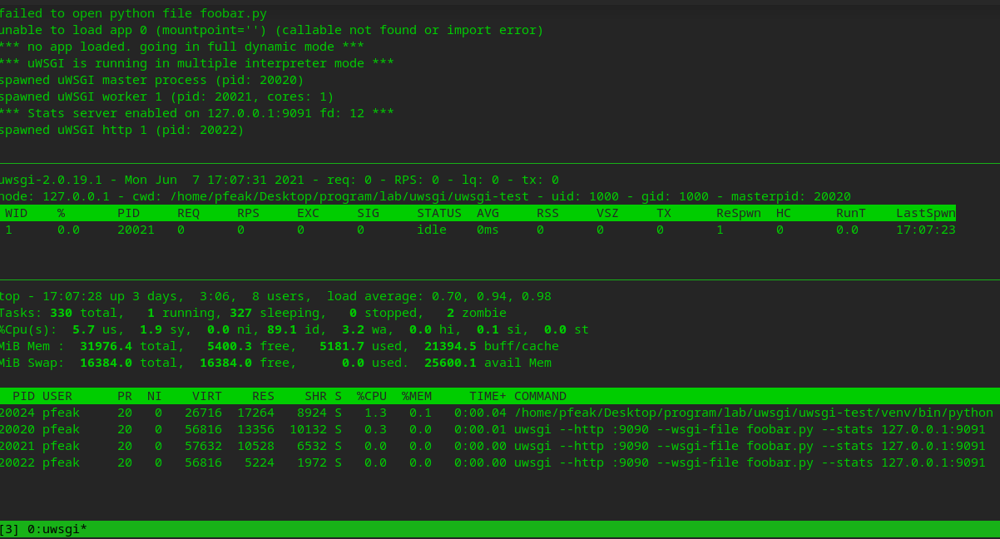

# uwsgi 安装与使用


## 0. 工具描述

uWSGI 是一个 Web 服务器，它实现了 WSGI 协议、uwsgi、http 等协议。Nginx 中 HttpUwsgiModule 的作用是与 uWSGI 服务器进行交换。

要注意 WSGI / uwsgi / uWSGI 这三个概念的区分。

- WSGI 是一种通信协议。
- uwsgi 是一种线路协议而不是通信协议，在此常用于在 uWSGI 服务器与其他网络服务器的数据通信。
- 而 uWSGI 是实现了 uwsgi 和 WSGI 两种协议的 Web 服务器。

uwsgi 协议是一个 uWSGI 服务器自有的协议，它用于定义传输信息的类型（type of information），每一个 uwsgi packet 前 4 byte 为传输信息类型描述，它与 WSGI 相比是两样东西。

uwsgitop 是 uwsgi 监控工具。


## 1. 工具安装

### 1.1 uwsgi 安装

**安装依赖环境**：`apt-get install build-essential python-dev`

**安装 uwsgi**：`pip install uwsgi`

**测试 uwsgi 安装成功**：

创建脚本 foobar.py

```python
# cat foobar.py
def application(env, start_response):
    start_response('200 OK', [('Content-Type','text/html')])
    return [b"Hello World"]
```

通过命令行启动 uwsgi（进程或线程方式启动，开销资源不同）

```shell
# --http 指定地址端口；--wsgi-file 指定文件
uwsgi --http :9090 --wsgi-file foobar.py
# 启动 4 进程、2 线程
uwsgi --http :9090 --wsgi-file foobar.py --master --processes 4 --threads 2
```

通过浏览器访问 9090 端口


### 1.2 uwsgitop 安装

**安装 uwsgitop**：`pip install uwsgitop`

**测试 uwsgitop 安装成功**：

```shell
# --stats 使用 stats 子系统，监控的数据格式是 JSON
uwsgi --http :9090 --wsgi-file foobar.py --stats 127.0.0.1:9091

# 通过 uwsgitop 查看 uwsgi 运行情况（1 秒刷新一次）, 需要 uwsgi 开启 stats 功能
uwsgitop 127.0.0.1:9091 --frequency 1
```

通过 `tmux` 查看结果（从上到下窗口依次是 "uwsgi 运行"、"uwsgitop 监控"、"top 过滤 uwsgi"）




## 2. uwsgi 配置

uwsgi 可通过配置文件（文件 `*.ini`）运行，支持多种实用的配置参数。

> 查看配置可选参数：uwsgi --help
>
> 启动 uwsgi：uwsgi --ini uwsgi.ini
>
> 重启 uwsgi：uwsgi --reload uwsgi.pid // uwsgi.pid 文件路径在 ini 文件中配置，uwsgi 启动后所开启进程的 pid 号会自动写入该文件
>
> 关闭 uwsgi：uwsgi --stop uwsgi.pid

```ini
[uwsgi]
pidfile=uwsgi.pid // 存放 uwsgi 进程的 pid，便于重启和关闭操作
chdir=/project // 指定项目目录为主目录
vacuum=true // 退出时清除环境变量

http-socket=:9090 // 配置 uwsgi 监听的 socket(ip+端口）
wsgi-file=foobar.py // 调用的主程序文件，绝对路径或相对于该 ini 文件位置的相对路径均可
callable=app // uwsgi 调用的 python 应用实例名称，Flask 里默认是 app，根据具体项目代码实例命名来设置

enable-threads=true	// 允许在请求中开启新线程
master=true	// 以独立守护进程运行
processes=8	// 配置进程数量
threads=4 // 配置线程数量
cheaper=10 // 一个高阶的 cheap 模式，在启动的时候只会分配 n 个 worker 进程，并使用自适应算法启动新的进程
idle=60	// 在经过 sec 秒的不活跃状态的进程会被销毁（进入了 cheap 模式），并最少保留 cheaper 指定的进程数

reload-on-rss=100 // 设置工作进程使用物理内存超过 N MB 就回收重启
reload-on-as=1024 // 设置工作进程使用虚拟内存超过 N MB 就回收重启
max-requests=500000	// 设置工作进程每处理 N 个进程就会被回收重启

;开放数据查询为 uwsgitop 等提供数据支持
stats=127.0.0.1:9091 // 返回一个 json 串，显示各进程和 worker 的状态
memory-report = true // 开启内存使用情况，通过 uwsgitop 字段 RSS、VSZ 查看
auto-procname = true // 自动设置更有意义的进程名
procname-prefix-spaced = test-uwsgi-ax // 自定义进程名前缀

;异步任务处理器 spooler 配置
spooler-import = /path/to/task.py // 引用 spooler 异步处理 task
spooler = /path/to/tmp/mytasks // spooler 任务以文件形式存放的位置
spooler-processes=4 // 启动异步处理器个数
spooler-frequency=1 // 异步处理器查询 /path/to/tmp/mytasks 现有任务频率，默认 30 秒
spooler-quiet // 执行任务不打印详细数据
```

uwsgi.ini 配置可用环境变量、"[通配符](https://uwsgi-docs-zh.readthedocs.io/zh_CN/latest/Configuration.html)"：

1. 环境变量：`processes=$MY_PROCESSES`（环境变量不要以 `UWSGI` 开头，可能会识别为 UWSGI 内置参数导致报错）；
2. "通配符"：`processes=%k`，`%k` 代表检测到的 `cpu` 核数。


## 3. python 异步任务

### 3.1 安装 uwsgidecorators

`pip install uwsgidecorators`

### 3.2 使用方式

代码里常用 @uwsgidecorator.spool 等装饰器实现异步任务：

* [使用uWSGI的spooler做异步任务](https://www.kawabangga.com/posts/3101)

* [中文文档](https://uwsgi-docs-zh.readthedocs.io/zh_CN/latest/PythonDecorators.html)

* [英文文档](https://uwsgi-docs.readthedocs.io/en/latest/PythonDecorators.html)

### 3.3 调试技巧

由于 uwsgi 启动 python app 后使用各种调试方法比较麻烦，所以区分开发与生产环境，开发环境中采用同步请求的方式正常调试。

```python
# func.py
def my_func(name: str, age: int) -> bool:
    """处理函数"""
    print(name, age)
    # do something
    return True
```

```python
# task.py
@spool(pass_arguments=True)  # 展开参数形式传参
def my_task(name: str, age: int):
    """异步任务"""
    my_func(name, age)
```

```python
# service.py
# 设置环境变量 debug=1 进入调试模式
debug = os.getenv("debug")
if os.getenv("extract_debug"):
    from xxx.api.v1 import func
else:
    from xxx.api.v1 import task

...

def my_service():
    if debug:
       ok = func.my_func(name="张三", age="18")
    else:
       task.my_task(name="法外狂徒", age="20")
```

如上定义，开发时设置环境变量 `debug=1` 可以同步调试；生产环境中使用 `uwsgi --ini xxx.ini` 进入异步调用。


## 4. 参考

[1] [Python uWSGI 安装配置](https://www.runoob.com/python3/python-uwsgi.html)

[2] [uwsgi 服务器配置及管理](https://blog.csdn.net/wyfcode/article/details/86258232)

[3] [uwsgi 配置详解](https://www.cnblogs.com/mensiler/p/11889546.html)

[4] [配置 uWSGI](https://uwsgi-docs-zh.readthedocs.io/zh_CN/latest/Configuration.html)

