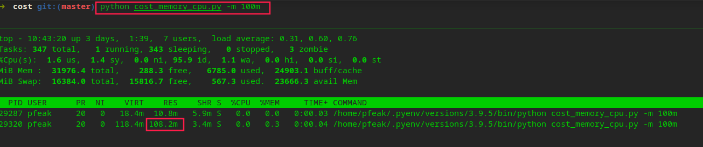
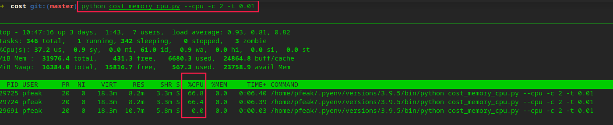

# Python CPU Memory Cost

**脚本功能：**占用 cpu、memory 模拟特定生产环境。

**使用方式：**

```shell
# 查看帮助
python cost_memory_cpu.py -h

# 指定占用 memory
# 示例：指定占用 100m 大小内存
python cost_memory_cpu.py -m 100m

# 指定占用 cpu
# 示例：指定使用两核 CPU，运算效率 0.01（运算频率时间间隔，越小占用越高）
python cost_memory_cpu.py --cpu -c 2 -t 0.01

# 同时指定 memory、cpu
# 示例：
python cost_memory_cpu.py -m 100 m --cpu -c 2 -t 0.01
```

**使用示例：**

占用指定内存



占用 CPU



**脚本内容：**

```python
# coding=utf-8
import re
import sys
import time
from multiprocessing import cpu_count
from multiprocessing import Process

MEMORY_SIZE = '10m'
CPU_COUNT = cpu_count()
TIME_PERIOD = 0.01


def helper(error: str = ""):
    print("脚本简介：")
    print("\t执行该脚本让计算机 “消耗内存” 或 “占用CPU” 模拟一些特殊情况.")
    print("使用：")
    print("\t查看帮助 python cost_memory_cpu.py -h")
    print("\t消耗内存")
    print("\t\t参数：")
    print("\t\t\t-m 指定消耗内存大小")
    print("\t\t格式：python cost_memory_cpu.py -m [Number][m|g]")
    print("\t\t示例：python cost_memory_cpu.py -m 100m")
    print("\t占用 CPU")
    print("\t\t参数：")
    print("\t\t\t--cpu 开启 cpu 占用")
    print("\t\t\t-c 指定 CPU 核数，不指定则默认最大核数")
    print("\t\t\t-t 指定运算频率时间间隔，越小占用越高")
    print("\t\t格式：python cost_memory_cpu.py --cpu -c [Number] -t [Float]")
    print("\t\t示例：python cost_memory_cpu.py --cpu -c 2 -t 0.01")
    print("")
    print("\t综合使用：python cost_memory_cpu.py -m 100 m --cpu -c 2 -t 0.01")
    print("")
    if error != "":
        print(f"error: {error}")


def memory_executor(size: int, unit: str):
    """内存 消耗进程
    """
    if unit == 'm':
        s = ' ' * (size * 1024 * 1024)
    elif unit == 'g':
        s = ' ' * (size * 1024 * 1024 * 1024)
    time.sleep(60 * 60 * 4 * 30)  # 挂起 1 个月


def cpu_executor(period: float):
    """CPU 消耗进程
    """
    while True:
        for i in range(0, 1000000):
            pass
        time.sleep(period)


def cost_memory() -> [Process]:
    """消耗指定内存

    :return: 成功执行返回 0
    """
    global MEMORY_SIZE

    pattern = re.compile("^(\\d*)([m|g])$")
    match = pattern.match(MEMORY_SIZE.lower())
    if match:
        num = int(match.group(1))
        unit = match.group(2)

        if unit not in ['m', 'g']:
            helper("指定 “消耗内存” 错误！")
            exit(-1)

        p = Process(target=memory_executor, args=(int(num), unit,))
        return [p]

    helper("指定 “消耗内存” 错误！")
    exit(-1)


def cost_cpu() -> [Process]:
    """占用 CPU

    """
    global CPU_COUNT
    global TIME_PERIOD

    cpu_list = []
    for i in range(0, int(CPU_COUNT)):
        cpu_list.append(Process(target=cpu_executor, args=(float(TIME_PERIOD),)))
    return cpu_list


def main():
    global MEMORY_SIZE
    global CPU_COUNT
    global TIME_PERIOD

    cost_list = list()

    if len(sys.argv) <= 1 or '-h' in sys.argv:
        helper()
        exit(-1)

    if '-m' in sys.argv:
        MEMORY_SIZE = sys.argv[sys.argv.index('-m') + 1]
        memory_list = cost_memory()
        cost_list = memory_list

    if '--cpu' in sys.argv:
        if '-c' in sys.argv:
            CPU_COUNT = int(sys.argv[sys.argv.index('-c') + 1])
            if CPU_COUNT <= 0:
                CPU_COUNT = 1
        if '-t' in sys.argv:
            TIME_PERIOD = float(sys.argv[sys.argv.index('-t') + 1])
        cpu_list = cost_cpu()
        cost_list.extend(cpu_list)

    try:
        for process in cost_list:
            process.start()
        for process in cost_list:
            process.join()
    except KeyboardInterrupt:
        print("资源消耗结束!")
        exit(0)


if __name__ == "__main__":
    main()
```
