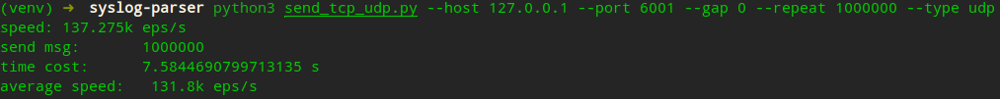

# Python send udp/tcp

**脚本功能：**循环发送 UDP、TCP 报文。

**使用方式：**

```shell
# 查看帮助
python cost_memory_cpu.py -h

# 发送 udp
# 示例：向本地 127.0.0.1:6001 发送 10000 条 udp 报文，发送间隔 0 秒
python3 send_tcp_udp.py --host 127.0.0.1 --port 6001 --gap 0 --repeat 10000 --type udp

# 发送 tcp
# 示例：向本地 127.0.0.1:6002 发送 10000 条 tcp 报文，发送间隔 0 秒
python3 send_tcp_udp.py --host 127.0.0.1 --port 6002 --gap 0.01 --repeat 10000 --type tcp
```

**使用示例：**

发送 udp



**脚本内容：**

```python
# coding=utf-8
import time

import socket
import argparse

# Create ArgumentParser() object
parser = argparse.ArgumentParser(
    usage='python3 send_tcp_udp.py --host 127.0.0.1 --port 6001 --gap 0 --repeat 1000000 --type tcp',
    description='Send TCP/UDP to target Host')

# Add argument
parser.add_argument('--host', required=True, help='target host')
parser.add_argument('--port', type=int, default=6001, help='target port, default 6001')
parser.add_argument('--gap', type=float, default=0.01, help='send gap, default 0.01')
parser.add_argument('--repeat', type=int, help='repeat count, default 0 means unlimited')
parser.add_argument('--type', type=str, default='udp', help='type of message(tcp or udp), default udp')

# Parse argument
args = parser.parse_args()

# log str
test_str = b'{"host":"1.1.1.1", "message":"nice to meet you2"}\n'

if __name__ == "__main__":
    repeat, repeat_ok = (args.repeat, True) if args.repeat else (0, False)
    address = (args.host, args.port)
    my_socket = None
    if str(args.type).lower() == "udp":
        my_socket = socket.socket(socket.AF_INET, socket.SOCK_DGRAM)
    elif str(args.type).lower() == "tcp":
        my_socket = socket.socket(socket.AF_INET, socket.SOCK_STREAM)
        my_socket.connect(address)
    else:
        print("error type, please input --udp in [tcp, udp]")
        exit(-1)

    COUNT = 0
    increment = 0
    start = time.time()
    tmp_start = start
    while True:
        time.sleep(args.gap)
        my_socket.sendto(test_str, address)
        # my_socket.send(test_str)

        if repeat_ok:
            COUNT += 1
            if COUNT >= repeat:
                break

        increment += 1
        now = time.time()
        if int(now - tmp_start) >= 1:
            speed = increment
            tmp_start = now
            increment = 0
            print(f"\rspeed: {speed / 1000}k eps/s", end='')

    end = time.time()
    cost = end - start
    print(f"\nsend msg:\t{COUNT}\r\ntime cost:\t{cost} s")
    print(f"average speed:\t{COUNT / cost / 1000: .1f}k eps/s")

# Usage:
# 	python3 send_tcp_udp.py --host 192.168.1.1 --port 6001 --gap 0
```
