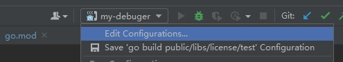
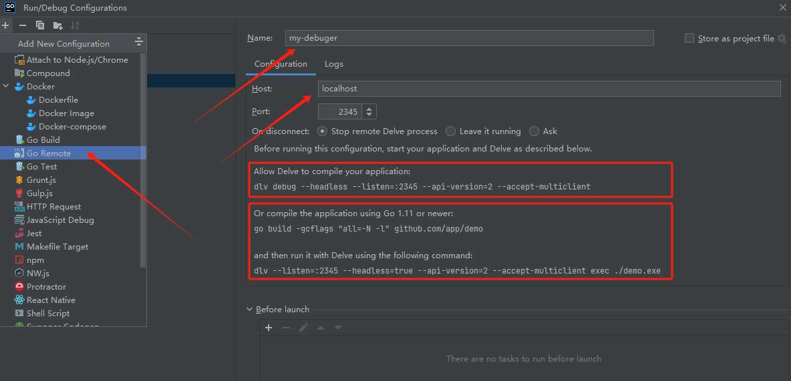

# delve 远程调试

delve 是 golang 的 debuger，用来调试 go 语言代码程序，本篇主要讲述**利用 delve 远程调试**

Github：https://github.com/go-delve/delve

## 1 背景

工作场景时而遇到某些 golang 程序实现某些功能只能在 docker 中执行

例如代码控制启动容器、获取容器中的某些配置

这些功能本地调试根本无法动态调试，必须在 docker 中执行

而插桩调试效率又太低，所以就需要满足一种需求：**本地代码动态在docker中（远程）调试**

## 2 环境

操作系统：Ubuntu22.04.2TLS（Win10 WSL）

IDE：goland

## 3 安装

### 3.1 方式一：手动安装

启动具备 golang 环境的容器，进入容器，再按照 [Github delve 安装文档](https://github.com/go-delve/delve/tree/master/Documentation/installation) 所述安装 dlv

### 3.2 方式二：构建镜像（推荐）

创建 dockerfile 内容如下

```dockerfile
FROM golang:1.20.10-alpine3.18

WORKDIR /app

RUN go env -w GOPROXY='https://goproxy.cn,direct' &&  \
    go install github.com/go-delve/delve/cmd/dlv@v1.21.2

ENTRYPOINT ["/bin/sh"]
```

编译镜像

```shell
docker build -t debuger/dlv-1.21.2:golang-1.20.10-alpine3.18 .
```

>上述 golang 及 dlv 版本可以根据各自情况替换

## 4 远程调试

### 4.1 启动镜像

若是构建镜像，则启动镜像

```shell
docker run -it --rm --name=golang-debuger -p 2345:2345 -v /path/to/package:/app debuger/dlv-1.21.2:golang-1.20.10-alpine3.18
```

>-it 交互式  
--rm 退出后删除容器  
--name 指定容器名  
-p 端口映射  
-v 挂载目录，将带 go.mod 的目录挂载到容器内

（可选）若需在容器中调试 docker 还需挂载 docker.sock

```shell
docker run -it --rm --name=golang-debuger -p 2345:2345 -v /path/to/package:/app -v /var/run/docker.sock:/var/run/docker.sock debuger/dlv-1.21.2:golang-1.20.10-alpine3.18
```

### 4.2 远程调试

在调试容器中对应想要调试的代码目录执行命令开启监听

```shell
dlv debug --headless --listen=:2345 --api-version=2 --accept-multiclient
```

IDE 创建 Go Remote 调试，按照提示配置好





然后在代码中断点，点击右上IDE调试按钮，就可以远程在容器中调试