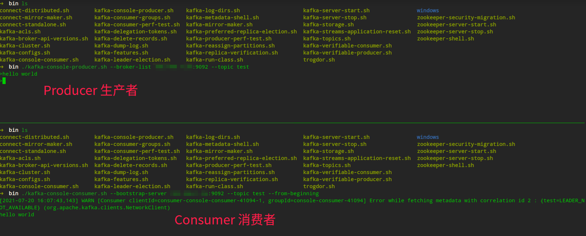

# Kafka 环境搭建

**官方下载地址：**https://kafka.apache.org/downloads

## 1. Kafka 下载

从官方网站下载 Kafka 并解压到合适的目录。

## 2. 修改配置文件

修改 Kafka 根目录 config 文件夹下与 zookeeper、kafka 有关的配置文件。

config/zookeeper.properties

```shell
# the directory where the snapshot is stored.
dataDir=/tmp/zookeeper # 修改快照存放路径为任意 => dataDir=../tmp/zookeeper
```

config/server.properties

```shell
# The address the socket server listens on
listeners=PLAINTEXT://your_ip:9092 # your_ip 更换为当前 ip
# A comma separated list of directories under which to store log files
log.dirs=/tmp/kafka-logs # 修改快照存放路径为任意 => log.dirs=../tmp/kafka-logs

# 如果要布置集群，将这个 id 修改为独一无二即可
# The id of the broker. This must be set to a unique integer for each broker.
broker.id=0
```

## 3. Kafka 运行

**启动命令**

```bash
# Linux 进入 bin 目录，执行 sh 文件
# Windows 进入 bin/windows 目录，执行 bat 文件

# 启动 zk
zookeeper-server-start.sh ..\config\zookeeper.properties

# 启动 kafka
kafka-server-start.sh ..\config\server.properties

# 启动 producer，your_ip 必须与 config/server.properties 配置中 listeners 一致
kafka-console-producer.sh --broker-list your_ip:9092 --topic test

# 启动 consumer，your_ip 必须与 config/server.properties 配置中 listeners 一致
kafka-console-consumer.sh --bootstrap-server localhost:9092 --topic test --from-beginning
```

> Kafka 基于 zookeeper 开发，所以需要先启动 zookeeper


**启动成功**

zookeeper 启动成功后会显示 `binding to port 0.0.0.0/0.0.0.0:2181`

kafka 启动成功后会显示 `Recorded new controller, from now on will use broker 192.168.1.24:9092 (id: 0 rack: null)`


**验证成功**

成功启动 producer、consumer 后输入 `hello world` 验证




