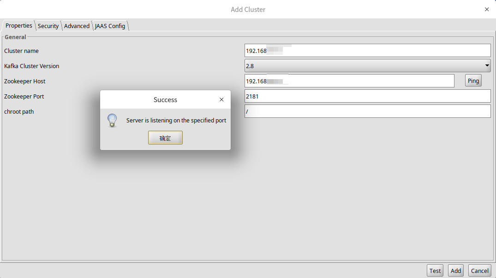

# Offset Explorer

​		Offset Explorer（以前称为 Kafka Tool）是一个用于管理和使用 Apache Kafka ® 集群的 GUI 应用程序。它提供了一个直观的 UI，允许人们快速查看 Kafka 集群中的对象以及存储在集群 Topic 中的消息。

官网：https://www.kafkatool.com/

## 1. Download

下载地址：https://www.kafkatool.com/download.html

win：直接下载，安装运行。

linux：点击发现是一个 sh 文件，并不能直接下载，需要如下操作安装。

```shell
curl https://www.kafkatool.com/download2/offsetexplorer.sh -o offsetexplorer
chmod 755 offsetexplorer
./offsetexplorer
```

## 2. Run

直接运行后，需简单配置，即可使用。

## 2.1 显示字符

Tools -> Settings -> Topics，更改 `Key`，`Value` 为 String。


## 2.2 连接 kafka

File -> Add New Connection，Properties 填写 zookeeper 配置，点击 ping 测试连接 zk 是否成功。



切换到 Advanced 选项卡，填写 Bootstrap servers 可以更快速直连 Kafka。


最后点击 Test 成功后，开始使用（后面使用比较简单，自行摸索）。


