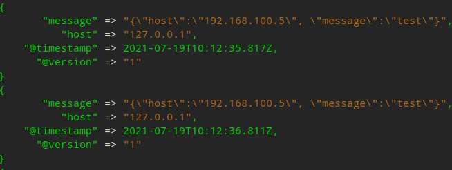

# Logstash 环境搭建

**官方下载地址：**https://www.elastic.co/cn/downloads/logstash

## 1. Logstash 下载

从官方网站下载对应平台 Logstash 并解压到合适的目录。

## 2. Logstash 运行

**运行 logstash**

> logstash 运行需要先运行 elasticsearch。

logstash 根目录下 config 文件夹，新建文件 test.conf（读取 6001 端口 udp 输出到控制台）

```shell
input {
    udp {
        port => 6001
    }
}

output {
	stdout {
	    codec => rubydebug
	}
}
```

执行命令开启 logstash

```shell
# -f 指定测试规则，不指定则默认根目录下规则
bin/logstash -f config/test.conf
```

**验证成功**

新建 terminal 执行 [测试脚本](README.md#send_udp) 测试启动成功

```shell
python3 send_udp.py --host 127.0.0.1 --port 6001 --gap 1
```

logstash 成功接收到日志


