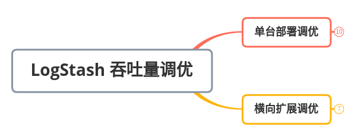
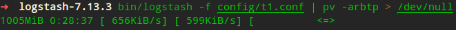
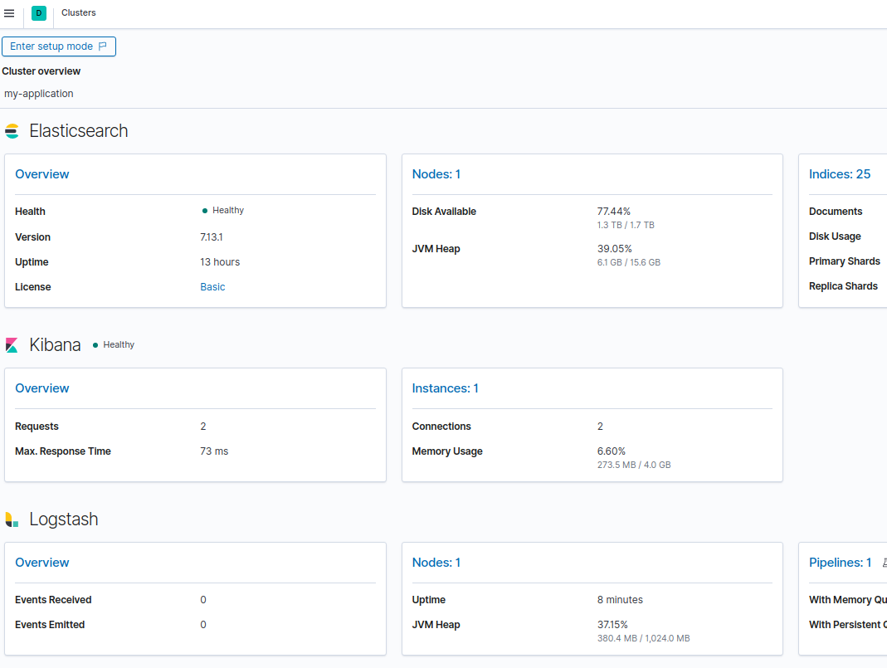
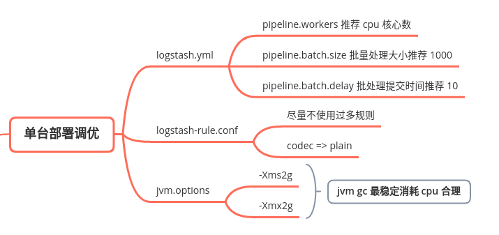
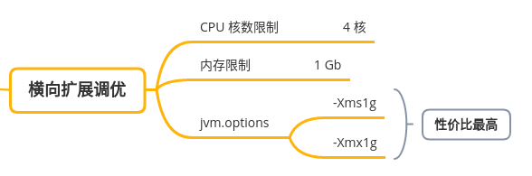
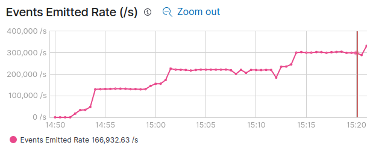

# Logstash 性能调优



Logstash 性能调优有两种思路：

1. 条件充足——直接加设备横向扩展；
2. 条件有限——根据实际硬件条件，修改 Logstash 配置提高性能。

这里都只考虑 Logstash 性能调优，不考虑网络、硬件磁盘 IO 短板的情况。


## 0. 极限压力测试（可跳过）

极限压力测试只能表示当前设备 logstash 最高收发性能，不可带入实际使用场景性能。

1.  **安装 Linux `pv` 工具**

   pv 工具用来查看 logstash 管道速度（会用到参数 `-arbtp`）。

2. **准备 logstash 规则**

   logstash 插件 `generator` 可生成测试数据，也可用脚本直接发送 TCP/UDP 报文进行测试；

   logstash 插件 `codec`  选项 `dots` 可将每条日志转换成大小 1b 的一个点（dot），也就是 1 eps。

   ```yml
   input {
       generator {
           count => 0
           message => '{"host":"192.168.1.24", "message":"hello world"}'
           id => "my_plugin_id1"
           codec => plain {
               charset => "UTF-8"
           }
       }
       ...
       ...
       generator {
           count => 0
           message => '{"host":"192.168.1.24", "message":"this is 16"}'
           id => "my_plugin_id16"
           codec => plain {
               charset => "UTF-8"
           }
       }
   }
   
   output {
       stdout {
           codec => dots
       }
   }
   ```

3. **极限压力测试**
	测试命令：`bin/logstash -f config/t1.conf | pv -arbtp > /dev/null`

	


## 1. 准备调优环境

* elasticsearch（提供 logstash、kibana 数据查询与持久化）
* logstash
* kibana（图形化监测 logstash 性能指标）

### 1.1 elasticsearch

**官方下载地址：**https://www.elastic.co/cn/start

下载 elasticsearch，修改配置文件 config/elasticsearch.yml 开启数据采集，启动 elasticsearch。

```yml
xpack.monitoring.collection.enabled: true
# xpack.monitoring.collection.interval 采集频率，需同步 kibana.yml
# 参考：https://www.elastic.co/guide/en/elasticsearch/reference/current/monitoring-settings.html
```

### 1.2 logstash

**官方下载地址：**https://www.elastic.co/cn/downloads/logstash

下载 logstash，修改配置文件 config/logstash.yml 开启数据采集，启动 logstash。

```yml
xpack.monitoring.enabled: true
xpack.monitoring.elasticsearch.hosts: ["http://127.0.0.1:9200"]

# 参考：
# https://www.elastic.co/guide/en/logstash/current/configuring-logstash.html
# https://www.elastic.co/guide/en/logstash/7.13/monitoring-internal-collection-legacy.html
```

### 1.3 kibana

**官方下载地址：**https://www.elastic.co/cn/start

下载并运行 kibana，`http://localhost:5601` 访问 kibana。

左侧通过 `Management->Stack Monitoring` 已经可以查看 Elasticsearch、Kibana、Logstash 状态。




## 2. 单台部署调优



logstash 单台部署调优从三个方面入手：

1. logstash 配置
2. logstash 数据收发规则
3. logstash jvm 配置

### 2.1 logstash 配置

config/logstash.yml

```yml
# pipeline worker 数量，默认 cpu 核心数，不用更改此选项
# pipeline.workers: 12

# 在发送给 filters+workers 之前，要从输入中检索多少个事件，也就是批处理大小
# pipeline.batch.size: 125
pipeline.batch.size: 1000

# 在轮询下一个事件时要等待多长时间（以毫秒为单位），再向 filters+outputs 分派一个尺寸不足的批次。
# pipeline.batch.delay: 50
pipeline.batch.delay: 10
```

### 2.2 logstash 数据收发规则

logstash 收发规则：

* input、filter、output 每个操作都会降低很多性能
* 尽量减少 input、filter、output 三种类操作复杂度
* codec 插件尽量用 plain 而不是 json 性能会提升很多

总而言之就是把 logstash 纯粹当成是一个收数据的工具，而不是处理、清洗数据的工具。

### 2.3 logstash jvm 配置

config/jvm.options

```yml
# 过小的 jvm 会导致不停地垃圾回收，可用工具 visualvm 查看 jvm 内存使用情况。
-Xms2g
-Xms2g
```


## 3. 横向扩展调优



logstash 横向扩展调优从两个方面入手：

1. 硬件
2. jvm 配置

### 3.1 硬件

logstash 是无状态的，所以 logstash 集群可以横向扩展（在不同的设备上扩展），线性提升性能。

1. 最低 cpu 4 核 1G 内存（有条件多多益善）
2. jvm 内存给 1g 是性价比最高的方案（有条件多多益善）

> 注意：横向扩展后，需要把采集对象发送 logstash 地址修改为最新 logstash 的地址，如果不修改扩展再多性能也不会提升。

横向扩展结果：4 台服务器节点，另起 4 台数据采集，一共八台服务器


