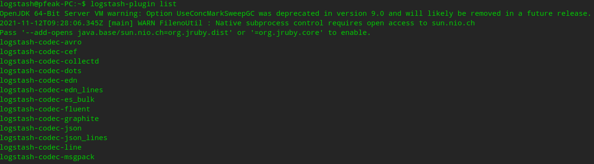
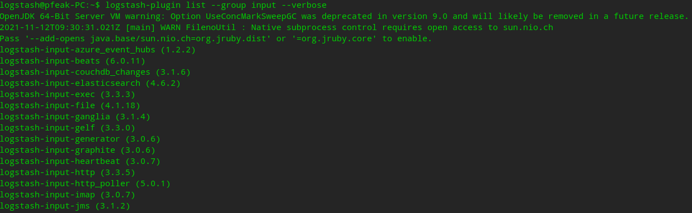

# Logstash 插件管理

Logstash 有许多插件涉及 input，output，filter，codec 等等，可以通过其自带的插件 logstash-plugin 管理插件。

## 1. 插件展示

Commond：`logstash-plugin list`



这里看不到插件具体版本，需要参数 `--verbose`。

插件太多需要过滤，使用参数 `--group input/output/fileter/codec/etc...`。

Command：`logstash-plugin list --group input --verbose`



这样就可以查看 logstash 插件版本。


## 2. 安装、卸载与更新

### 2.1 Plugin 换源

安装与更新插件之前需要挂代理或者换源，否则默认插件下载地址 `https://rubygems.org` 会很慢。

```shell
# 进入目录换成 taobao 的地址源
cd /usr/share/logstash
sed s#https://rubygems.org#https://ruby.taobao.org#g Gemfile
```

### 2.2 Plugin 安装与卸载

#### 2.2.1 安装

Command：`logstash-plugin install [插件名]`

```shell
# 例如：安装 syslog 插件
logstash-plugin install logstash-input-syslog
```

#### 2.2.2 卸载

Command：`logstash-plugin uninstall [插件名]`

```shell
# 例如：卸载 syslog 插件
logstash-plugin uninstall logstash-input-syslog
```

#### 2.2.3 离线安装

#####  制作指定插件离线安装包

Command：`logstash-plugin prepare-offline-pack --overwrite --output [导出插件压缩包名] [插件名]`

参数说明：

`--overwrite`：覆盖已有的文件

`--output`：输出文件（默认 /usr/share/logstash/logstash-offline-plugins-x.x.x.zip）

```shell
# 导出 logstash-input-syslog 插件安装包 logstash-plugins.zip
logstash-plugin prepare-offline-pack --overwrite --output logstash-plugins.zip logstash-input-syslog
```

#####  安装离线安装包

Command：`logstash-plugin install --no-verify logstash-plugins.zip`

参数说明：

`--no-verify`：安装插件不校验（校验可能报错）

```shell
# 安装 logstash-plugins.zip 离线插件包
logstash-plugin install --no-verify logstash-plugins.zip
```

### 2.3 Plugin 更新

Command：`logstash-plugin update [插件名]`

```shell
# 例如：更新 syslog 与 udp 插件
logstash-plugin update logstash-input-syslog logstash-input-udp
```
