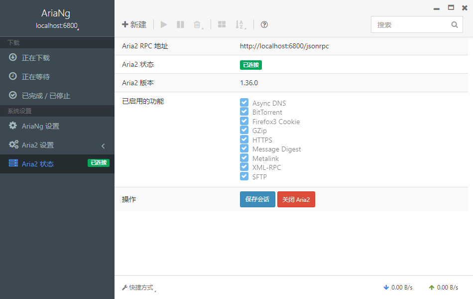

# aria2

**aria2** 是一个轻量级的多协议、多源、跨平台下载实用程序，在命令行中运行。它支持 HTTP / HTTPS，FTP，SFTP，BitTorrent 和 Metalink。https://github.com/aria2/aria2

**AriaNg-Native** 是一个比 AriaNg 更好的 aria2 桌面客户端，拥有 AriaNg 的所有功能，并提供更多的桌面使用功能。https://github.com/mayswind/AriaNg-Native

## 环境

操作系统：Win10

## 下载与使用

以下内容需要下载，其中 `aria2_bat`、`aria2_conf` 都是为了快捷操作 aria2：

- 最新 aria2：https://github.com/aria2/aria2/releases
- 最新 AriaNg-Native：https://github.com/mayswind/AriaNg-Native/releases
- aria2_bat.7z（aria2 启停脚本）：https://wwff.lanzoum.com/i9ZjH0xoasmd 密码:3nfn
- aria2_conf.7z（aria2 配置文件）：https://wwff.lanzoum.com/iOrhU0xoaslc 密码:g5rp

### aria2

1. 解压 `aria2` 到自定义路径

2. 将 `aria2_conf`、`aria2_bat` 解压到 `aria2` 根目录

    >`aria2_conf` 的配置文件可以自行修改，都有中文注释  
    >`aria2_bat` 存放启动 `aria2` 的脚本（功能都很简单但实用）

3. 执行 `Start.vbs` 启动脚本（`Stop.bat` 可停止脚本）

### AriaNg-Native

安装 `AriaNg-Native` 并启动，显示 `aria2` 已连接，可以开始正常使用。

