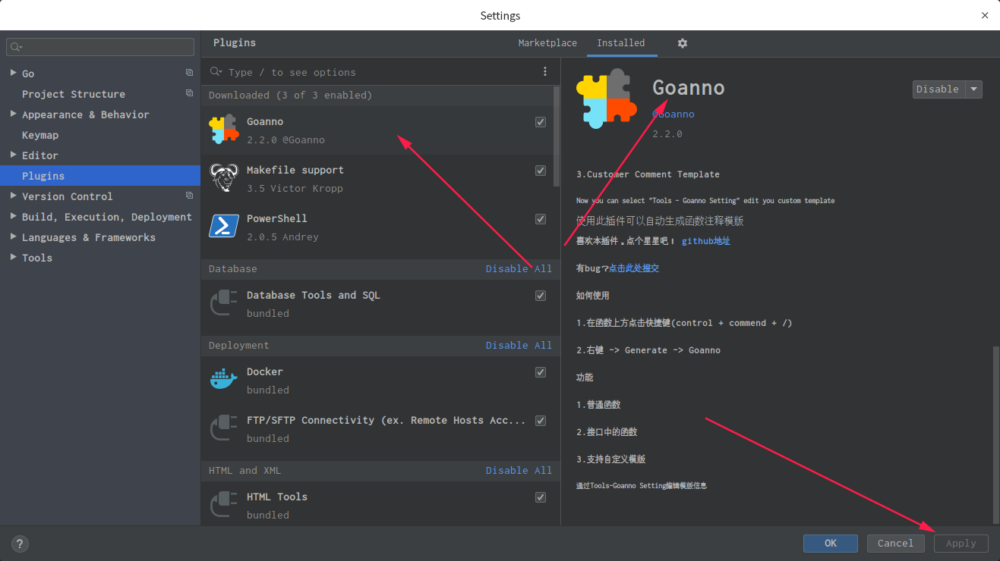
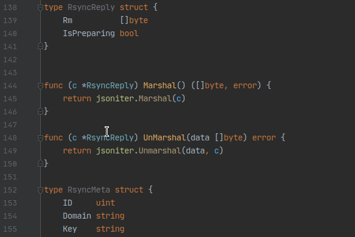
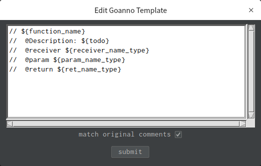

# GoLand 函数注释插件 Goanno

## 1. 插件简介

Goanno 是一款自动生成函数注释模板的 GoLand 插件。

功能：

* 生成普通函数注释
* 生成接口函数注释
* 自定义注释模板

>Now you can select "Tools - Goanno Setting" edit you custom template

## 2. 插件安装

使用 GoLand 自带的插件功能下载、安装。

具体步骤：

1. File -> Setttings -> Plugins -> 搜索 Goanno
2. install Goanno and apply



## 3. 插件使用

**快捷键**：`control + commend + /`（Linux 也就是 `Ctrl + Alt + /`）



**模板配置**：`Tools->Goanno Setting`



**推荐模板**：

```go
// ${function_name}
//  @Description: ${todo}
//  @receiver ${receiver_name_type}
//  @param ${param_name_type} 
//  @return ${ret_name_type}
```

**更多模板配置**：https://github.com/loveinsky100/goanno/
