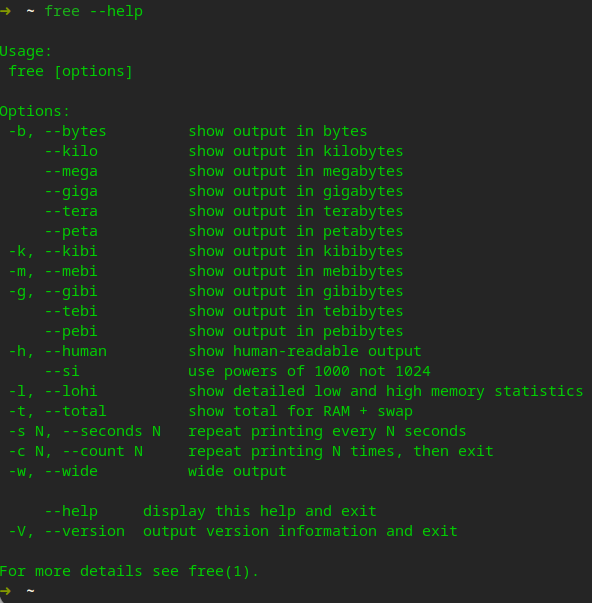

# free 命令使用

Linux free 命令用于显示内存状态。

## 1. 界面介绍

行：

* Mem（物理内存）
* Swap（硬盘交换分区）

列：

* total（总内存）
* used（已使用内存，包括 shared、buffers、cached）
* free（未分配的内存）
* shared（共享内存）
* buffers（块设备读写缓冲区）
* cached（文件系统 cached）
* available（可用内存）

## 2. 常用命令

**查看帮助**：`free --help`

**查看（便于理解的）内存信息**：`free -h`

**查看内存统计信息**：`free -ht`

**查看详细统计信息**：`free -htw`

