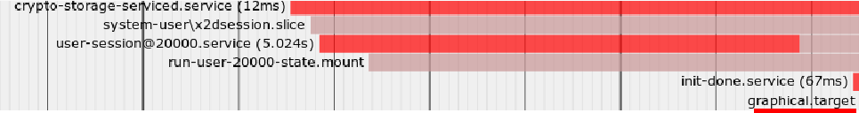

# systemd 命令使用

## 0. 介绍

Systemd 是 Linux 系统工具，用来启动[守护进程](https://www.ruanyifeng.com/blog/2016/02/linux-daemon.html)。

## 1. 基本使用

常用的 unit 配置文件存放路径 `/usr/lib/systemd/system/`。

| 功能                   | 命令                              |
| :--------------------- | --------------------------------- |
| 启动某服务             | systemctl start myserver.service |
| 停止某服务             | systemctl stop myserver.service |
| 重启某服务             | systemctl restart myserver.service |
| 查看某服务状态         | systemctl status myserver.service |
| 重新加载某服务配置     | systemctl reload myserver.service |
| 加载新增 unit 配置文件 | systemctl daemon-reload |
| 设置某服务开机自启     | systemctl enable myserver.service |
| 禁用某服务开机自启     | systemctl disable myserver.service |


## 2. 延时启动服务

### 2.1 查看 Linux 启动时间

```shell
➜  ~ systemd-analyze                          
Startup finished in 13.785s (firmware) + 5.291s (loader) + 4.745s (kernel) + 1min 39.904s (userspace) = 2min 3.727s 
graphical.target reached after 1min 39.896s in userspace
```

### 2.2 查看 Linux 应用启动顺序

```shell
➜  ~ systemd-analyze blame
```

### 2.3 查看应用和服务启动时间火焰图

```shell
➜  ~ systemd-analyze plot > test.svg
```



最后启动的服务是 graphical.target，将其设置 After 之后即可。

### 2.4 设置 systemd 延时启动 test.service

```shell
# /usr/lib/systemd/user/test.service
[Unit]
Description=test for delay
After=graphical.target

[Service]
ExecStart=/user/bin/test
Restart=always
RestartSec=1

[Install]
WantedBy=multi-user.target
```

实际测试，延时启动只适用于依赖条件启动。

每次启动各个服务的启动顺序可能有变化。


## 3. 定时启动服务

1. 定时启动文件

   mytimer.service

   ```shell
   [Unit]
   Description=备份tomcat前一天的log
   
   [Service]
   ExecStart=/root/sliceCatalina.sh
   ```

   mytimer.timer

   ```csharp
   [Unit]
   Description=每天凌晨一点备份tomcat前一天的log
   
   [Timer]
   OnCalendar=*-*-* 01:00:00
   Unit=mytimer.service
   
   [Install]
   WantedBy=multi-user.target
   ```

2. 启动定时任务

   ```shell
   systemctl daemon-reload  # 重新加载服务
   systemctl enable mytimer.timer
   systemctl start mytimer.timer
   ```
   
3. 查看运行状态

   ```shell
   systemctl status mytimer.timer
   journalctl -f -u mytimer.timer # 查看定时器运行日志
   ```

4. 关闭定时任务

   ```shell
   systemctl disable mytimer.timer #关闭开机启动（即删除目录链接）
   systemctl stop mytimer.timer # 关闭单元
   systemctl stop mytimer.service
   ```

5. 参数说明

   [Timer] 可以指定多种定时器，例如：

   ```shell
   OnActiveSec=       表示相对于本单元被启用的时间点
   OnBootSec=         表示相对于机器被启动的时间点
   OnStartupSec=      表示相对于systemd被首次启动的时间点
   OnUnitActiveSec=   表示相对于匹配单元(本标签下Unit=指定的单元)最后一次被启动的时间点
   OnUnitInactiveSec= 表示相对于匹配单元(本标签下Unit=指定的单元)最后一次被停止的时间点
   ```
   
   示例：
   
   每月26号的凌晨0点半执行一次：

    ```shell
    OnCalendar=*-*-26 00:30:00
    ```
   
   自定时器启动10分钟后间隔1小时执行一次

    ```shell
    OnBootSec=10min
    OnUnitActiveSec=1h
    ```

   时间单位：us(微秒), ms(毫秒), s(秒), m(分), h(时), d(天), w(周), month(月), y(年)。

   如果省略了单位，则表示使用默认单位 ‘秒’。可以写成 `5h 30min` 表示之后的 5 小时 30 分钟。

   示例：

   |规则|意义|
   |:-:|:-:|
   |Thu,Fri 2012-\*-1,5 11:12:13|2012年任意月份的1日和5日，如果是星期四或星期五，则在时间11:12:13执行|
   |\*-\*-\* \*:\*:00|每分钟执行|
   |\*-\*-\* 00:00:00|每天执行|
   |\*-01,07-01 00:00:00|每半年执行|
   |\*:0/15|每15分钟执行|
   |12,14,13:20,10,30|12/13/14点的10分、20分、30分执行|
   |Mon,Fri \*-01/2-01,03 \*:30:45|任意年份奇数月份的1日和3日，如果是周一或周五，则在每小时的30分45秒执行|

## 4. 参考

【1】[Ubuntu 之 systemd 延时启动服务](https://blog.csdn.net/u010164190/article/details/118578495)

【2】[Linux systemd定时器简单教程](https://www.jianshu.com/p/167b44bc1f65)

【3】[[linux基础命令介绍十四：定时任务](https://segmentfault.com/a/1190000007916299)]
