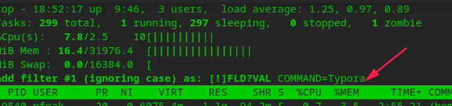

# top 命令使用

&emsp;&emsp;top 命令经常用来监控 Linux 的系统状况，是常用的性能分析工具，能够实时显示系统中各个进程的资源占用情况。

**启动 top**：`top`

## 常用快捷键

**显示 COMMAND 详细信息**：`c`

**切换内存（RES）、虚拟内存（VIRT）单位**，按一次切换一次不同的单位，不按默认 byte：`e`

**切换内存**使用条形图：`m`

**切换CPU**占用条形图：`t`

**指定列排序**：`f` 进入界面，上下移动选中项目后按 `s` 选取，再按 `q` 退出

**过滤**指定 COMMAND，：`o` 输入 `COMMAND=Typora`，注意 `=` 左右不留空格

**显示线程**：`H`

**设置刷新频率**：`s` 按一下然后输入秒

高亮组合：`x`、`y`、`b`
