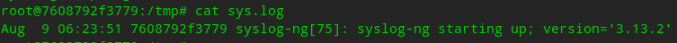

# Syslog-ng

> syslog-ng is an enhanced log daemon, supporting a wide range of input and output methods: syslog, unstructured text, message queues, databases (SQL and NoSQL alike), and more.

&emsp;&emsp;syslog-ng 是一个增强的日志守护程序，支持广泛的输入和输出方法：syslog、非结构化文本、消息队列、数据库（SQL和NoSQL都可以）等等。

**github**：https://github.com/syslog-ng/syslog-ng


## 1. Syslog-ng 环境搭建

### 1.1 通过 apt 安装

```shell
apt update
apt install -y syslog-ng
```

### 1.2 通过 docker 安装（推荐）

通过 DockerFile 与 dockrer-compose.yml 创建 docker 虚拟机，根据需求可挂载卷。

**DockerFile**

```dockerfile
FROM ubuntu:18.04

WORKDIR /etc/syslog-ng

RUN apt update && apt install -y --no-install-recommends net-tools inetutils-ping vim syslog-ng && rm -rf /var/lib/apt/lists/*
```

**docker-compose.yml**

```yaml
version: '3.7'

networks:
  syslog_ng:
    driver: bridge

services:
  syslog_ng:
    build: .
    image: syslog-ng:ubuntu-18.04
    container_name: syslog-ng
    restart: always
    ports:
      - 8888:8888/udp
      - 8888:8888
    networks:
      - syslog_ng
    tty: true
```

**启动容器**

```shell
docker-compose up -d
```


## 2. Syslog-ng 简单使用

进入容器，此时所在路径 `/etc/syslog-ng`，syslog 配置文件都在这个目录下（详细的配置可以看 `syslog-ng.conf` 内容）。

修改 `syslog-ng.conf` 最后内容如下（备份 syslog-ng.conf 防止误操作）

```bash
@version: 3.13
@include "scl.conf"

# First, set some global options.
options { chain_hostnames(off); flush_lines(0); use_dns(no); use_fqdn(no);
	  owner("root"); group("adm"); perm(0640); stats_freq(0);
	  bad_hostname("^gconfd$");
};

########################
# Sources
########################
source s_src {
       system();
       internal();
};
source s_udp { udp(ip(0.0.0.0) port(8888)); };

########################
# Destinations
########################
destination d_sys { file("/tmp/sys.log"); };
destination d_udp { file("/tmp/udp.log"); };

########################
# Log paths
########################
log { source(s_src); destination(d_sys); };
log { source(s_udp); destination(d_udp); };

@include "/etc/syslog-ng/conf.d/*.conf"
```

上面简单的配置了 `source`、`destination`、`log` 并未配置 `filter`，想要详细了解查看原版 `syslog-ng.conf`。

**syslog-ng 服务命令**：

查看状态 —— `service syslog-ng status`

启动服务 —— `service syslog-ng start`

重启服务 —— `service syslog-ng restart`

关闭服务 —— `service syslog-ng stop`

启动服务后可以查看到 `/tmp/sys.log` 文件已经被创建并已经有了日志。


